# Projektdokumentation

**Bachelorarbeit: „Vergleich verschiedener Driftregressoren im General Linear Model zur Schätzung der hämodynamischen Antwortfunktion in fNIRS-Daten"**
TU Berlin · Fachgebiet Neurotechnologie · Stand: 13. Juli 2026

---

## Für wen ist dieses Dokument?

Dieses Dokument erklärt **von Grund auf**, worum es in diesem Projekt geht, wie die
Software funktioniert und was bisher herausgekommen ist. Es ist bewusst so geschrieben,
dass man **keine Informatik- und keine Neurowissenschafts-Kenntnisse** braucht, um zu
verstehen, was hier passiert. Jeder Fachbegriff wird beim ersten Auftauchen erklärt; am
Ende gibt es ein Glossar zum Nachschlagen.

Inhalt:
1. [Das Projekt in einfachen Worten](#1-das-projekt-in-einfachen-worten)
2. [Die wichtigsten Begriffe – mit Alltagsvergleichen](#2-die-wichtigsten-begriffe--mit-alltagsvergleichen)
3. [Das Werkzeug „Cedalion" und seine Notebooks](#3-das-werkzeug-cedalion-und-seine-notebooks)
4. [Wie die Auswertung Schritt für Schritt funktioniert](#4-wie-die-auswertung-schritt-für-schritt-funktioniert)
5. [Der systematische Vergleich (der „Sweep")](#5-der-systematische-vergleich-der-sweep)
6. [Was bisher herausgekommen ist](#6-was-bisher-herausgekommen-ist)
7. [Die Dateien im Überblick](#7-die-dateien-im-überblick)
8. [Wie man alles ausführt](#8-wie-man-alles-ausführt)
9. [Was noch kommt (Ausblick)](#9-was-noch-kommt-ausblick)
10. [Glossar](#10-glossar)

---

## 1. Das Projekt in einfachen Worten

Wenn ein Bereich im Gehirn aktiv wird, verbraucht er mehr Sauerstoff, und der Körper
schickt kurz darauf **mehr Blut** dorthin. Diese Durchblutungsänderung kann man **von
außen durch den Schädel messen** – mit Licht. Genau das macht **fNIRS** (funktionelle
Nahinfrarotspektroskopie): schwaches Infrarotlicht wird auf den Kopf gestrahlt, ein Teil
davon kommt an anderer Stelle wieder heraus, und aus der Abschwächung lässt sich
berechnen, wie viel sauerstoffreiches und sauerstoffarmes Blut gerade unter der Haut
fließt.

Das Problem: Das gemessene Signal enthält **nicht nur** die Hirnaktivität, die uns
interessiert, sondern auch viel „Störung": Herzschlag, Atmung, langsames Wegdriften der
Messwerte, kleine Bewegungen. Besonders lästig ist das langsame **Driften** der Grundlinie
(englisch *drift*) – so, als würde ein Radiosender langsam wegwandern. Wenn man dieses
Driften nicht sauber herausrechnet, misst man die Hirnaktivität falsch.

Um das Driften herauszurechnen, baut man ins Auswertemodell (das **General Linear Model**,
siehe Kapitel 2) sogenannte **Driftregressoren** ein – mathematische „Formvorlagen" für das
langsame Driften. Davon gibt es verschiedene Sorten (Polynome, Cosinus-Funktionen,
Legendre-Polynome, B-Splines; dazu als Alternative einen Filter). **Die zentrale Frage der
Arbeit lautet:**

> **Welche Sorte von Driftregressor liefert unter welchen Bedingungen die genaueste
> Schätzung der Hirnaktivität?**

Für fMRT (die „große" Bildgebung im Kernspintomografen) ist das gut untersucht – für fNIRS
erstaunlicherweise kaum. Diese Lücke füllt die Arbeit.

**Vorgehen in zwei Stufen:**
1. **Simulation (aktueller Stand):** Wir nehmen echte Ruhemessungen (Person tut nichts) und
   „mischen" künstlich eine Hirnaktivität mit **exakt bekannter Stärke** hinein. Weil wir die
   Wahrheit kennen, können wir für jede Driftregressor-Sorte genau messen, wie nah die
   Schätzung an der Wahrheit liegt.
2. **Echte Daten (später):** Anwendung auf echte hochauflösende Messungen (300 Kanäle), bei
   denen Probanden *Tetris* spielen gegen Ruhe.

---

## 2. Die wichtigsten Begriffe – mit Alltagsvergleichen

**fNIRS** – Messung der Hirndurchblutung mit Infrarotlicht durch den Schädel. Nicht-invasiv,
tragbar, günstig.

**HbO und HbR** – die zwei Blut-Bestandteile, die fNIRS unterscheidet:
- **HbO** = oxygeniertes (sauerstoffreiches) Hämoglobin.
- **HbR** = deoxygeniertes (sauerstoffarmes) Hämoglobin.
Bei echter Hirnaktivität steigt **HbO** und sinkt **HbR** gleichzeitig (eine **inverse**
Beziehung). Findet man das im Signal, ist das ein gutes Plausibilitätszeichen.

**Kanal** – ein Messpunkt, gebildet aus einem Lichtsender und einem Lichtempfänger auf dem
Kopf. Viele Kanäle zusammen ergeben eine Karte der Hirnoberfläche. Unser Datensatz hat
**544 nutzbare Kanäle** – das ist „hochkanalig" und heißt auch **DOT** (Diffuse Optische
Tomografie).

**HRF (hämodynamische Antwortfunktion)** – die *typische Form* der Durchblutungsantwort auf
einen kurzen Reiz: Sie steigt über einige Sekunden an, erreicht nach ca. 5–6 s ein Maximum
und klingt dann wieder ab. Vergleich: Wirft man einen Stein ins Wasser, entsteht immer die
gleiche charakteristische Wellenform – die HRF ist diese „Standardwelle" der Durchblutung.

**Aktivierungsstärke β (beta)** – *wie hoch* die HRF-Welle an einem Kanal ausschlägt. Das
ist die eigentliche Zielgröße: β groß = starke Aktivierung. Die ganze Arbeit dreht sich
darum, dieses β möglichst genau zu **schätzen**.

**Drift** – langsames Wegwandern der Messwerte über die Zeit, unabhängig von jeder
Hirnaktivität (z. B. durch Erwärmung der Geräte, langsame Körpervorgänge). Der Störenfried,
den wir modellieren müssen.

**GLM (General Linear Model)** – das Auswertemodell. Idee: Das gemessene Signal wird als
**Summe mehrerer bekannter „Zutaten"** erklärt. Vergleich mit einem Rezept:

> gemessenes Signal ≈ β · (HRF-Zutat) + (Drift-Zutaten) + Rest.

Das GLM findet die Mischungsverhältnisse (u. a. das β), mit denen die Summe der Zutaten das
gemessene Signal am besten nachbildet. Die Tabelle aller Zutaten heißt **Designmatrix**.

**Driftregressor** – eine der „Drift-Zutaten" im Rezept. Es gibt mehrere Familien, die das
Driften unterschiedlich flexibel nachbilden:
- **Polynom (poly n):** einfache Kurven wachsender Krümmung (Gerade, Parabel, …). `n` = wie
  „gewellt" die Kurve sein darf.
- **DCT (diskrete Cosinus-Basis):** eine Sammlung von Cosinus-Wellen bis zu einer
  Grenzfrequenz – wirkt wie ein Hochpassfilter, lässt also nur „schnelle genug" Signale durch.
- **Legendre-Polynome:** mathematisch besonders „saubere" Polynome (gut trennbar).
- **B-Splines:** aus glatten Kurvenstücken zusammengesetzte, flexible Basis.
- **Butterworth-Hochpass:** *kein* Regressor im Rezept, sondern ein **Filter**, der das
  langsame Driften schon vor der Auswertung aus dem Signal entfernt – die *Alternative* zu
  Driftregressoren.
- **„none":** gar kein Drift-Modell (nur ein konstanter Grundwert) – als Vergleichs-Untergrenze.

**AR-IRLS** – das Schätzverfahren, mit dem das GLM gelöst wird. Es berücksichtigt, dass das
Rauschen in fNIRS nicht rein zufällig ist, sondern zeitlich „nachhallt" (autokorreliert).
**Wichtig:** AR-IRLS modelliert das *Rauschen*, nicht den *Drift* – der Drift kommt
ausschließlich über die Regressoren ins Modell.

**Ground Truth (Grundwahrheit)** – der bekannte, wahre Wert. In der Simulation kennen wir
β, weil wir es selbst hineingemischt haben. So können wir Schätzfehler exakt ausrechnen.

**Gütemaße** – womit wir „genau" messen (getrennt für HbO und HbR):
- **Bias (Verzerrung):** systematisches Daneben­liegen (im Schnitt zu hoch/zu niedrig).
- **Varianz / Streuung:** wie stark die Schätzung von Durchlauf zu Durchlauf schwankt.
- **RMSE (Wurzel des mittleren quadratischen Fehlers):** Gesamtfehler, fasst Bias und Streuung
  zusammen. Kleiner = besser.
Vergleich Dartscheibe: **Bias** = die Pfeile treffen konstant neben die Mitte; **Varianz** =
die Pfeile streuen weit; **RMSE** = wie schlecht insgesamt.

---

## 3. Das Werkzeug „Cedalion" und seine Notebooks

**Cedalion** ist ein frei verfügbares Python-Programmpaket zur fNIRS-/DOT-Auswertung,
mitentwickelt an der TU Berlin. Es liefert fertige, geprüfte Bausteine für alle Schritte
(Daten laden, Qualität prüfen, in Konzentrationen umrechnen, GLM rechnen, Aktivierung
simulieren, Karten zeichnen). Wir bauen darauf auf, statt alles selbst zu programmieren.

> **Grundsatz dieses Projekts:** Die offiziellen **Cedalion-Notebooks** (Schritt-für-Schritt-
> Beispiele) und die Dokumentation sind die **maßgebliche Referenz** – vor eigenem Wissen.
> Ein „Notebook" ist ein interaktives Dokument, das Erklärtext und lauffähigen Beispielcode
> mischt.

- **Online-Dokumentation:** https://doc.ibs.tu-berlin.de/cedalion/doc/dev/
- **Notebooks lokal:** im Schwester-Ordner `../cedalion/examples/`
- **Cedalion-Version in diesem Projekt:** 26.5.1 (Entwicklungszweig `dev`)

**Die für dieses Projekt wichtigsten Notebooks:**

| Notebook | Wofür |
|---|---|
| `examples/getting_started_io/13_data_structures_intro.ipynb` | Wie fNIRS-Daten in Cedalion aufgebaut sind |
| `examples/signal_quality/21_data_quality_and_pruning.ipynb` | Kanäle nach Signalqualität aussortieren |
| `examples/modeling/33_glm_illustrative_example.ipynb` | GLM verständlich erklärt |
| `examples/modeling/32_glm_fingertapping_example.ipynb` | GLM an echten Daten + **Kopf-Karten (scalp plot)** der β-Werte |
| `examples/modeling/31_glm_basis_functions.ipynb` | die HRF-„Formvorlagen" (Basisfunktionen) |
| `examples/modeling/35_statsmodels_overview.ipynb` | wie man die Ergebnisse (β, Statistik) ausliest |
| `examples/augmentation/62_synthetic_hrfs_example.ipynb` | **künstliche HRF einmischen** (Kernidee der Simulation) |
| `examples/tutorial/7_data_augmentation.ipynb` | Tutorial zur Datenaugmentation inkl. Kopf-Karten |

---

## 4. Wie die Auswertung Schritt für Schritt funktioniert

Das Herzstück ist die Datei `drift_glm/core/pipeline.py`. Sie baut aus Ruhedaten einen Testfall mit
**bekannter Wahrheit**. Hier die Schritte in Alltagssprache; in Klammern die
Cedalion-Bausteine und die Notebooks, an denen sie sich orientieren.

### Schritt 1 – Ruhedaten laden
Wir laden einen frei verfügbaren fNIRS-Ruhedatensatz („nn22"): eine Person, die ~6 Minuten
still sitzt. Er enthält **567 Kanäle**, misst mit ~**9 Messungen pro Sekunde**, bei zwei
Lichtfarben (760 und 850 Nanometer).
*(Cedalion: `cedalion.data.get_nn22_resting_state()`. Aufbau der Daten: Notebook
`getting_started_io/13`.)*

### Schritt 2 – Aufräumen: Bewegung herausrechnen, schlechte Kanäle aussortieren
Nicht jeder Kanal misst sauber, und die Person bewegt sich. Beides wird hier behandelt – in
einer **bestimmten Reihenfolge**, die nicht beliebig ist:

1. **Lichtstärke → optische Dichte.** Dabei wird der Ausgangspegel jedes Kanals (die
   „Baseline", also seine mittlere Helligkeit) **mitgespeichert**. Ohne ihn käme man später
   nicht zurück, denn die optische Dichte beschreibt nur *Änderungen* gegenüber dem eigenen
   Mittel, nicht die Helligkeit selbst.
2. **Bewegungsartefakte herausrechnen.** Sie treten in zwei Formen auf: als **scharfer
   Ausschlag** (Spike) und als **ruckartige Verschiebung** der Grundlinie. Dafür gibt es zwei
   Verfahren – *Wavelet* gegen Spikes, *TDDR* gegen Verschiebungen. Sie arbeiten auf der
   optischen Dichte, nicht auf der Helligkeit.
3. **Zurück zur Lichtstärke.** Erst hier lässt sich beurteilen, ob ein Kanal **zu dunkel**
   (kaum Licht, nur Rauschen) oder **gesättigt** ist (Detektor am Anschlag, Signal oben
   abgeschnitten). Beides sind Helligkeits-Begriffe – in der optischen Dichte sind sie gar
   nicht definiert. Deshalb der Umweg.
4. **Kanäle bewerten und aussortieren**, nach drei Kriterien: Signal-Rausch-Verhältnis
   (Schwelle 3), Helligkeitsfenster (0,001 bis 0,84 Volt), Sender-Empfänger-Abstand.
5. **Weiterarbeiten auf der optischen Dichte** und erst dann in Konzentrationen umrechnen.

Von **567** Rohkanälen bleiben **520** übrig: 6 fallen weg, weil ihre Lichtstärke stellenweise
auf null geht (physikalisch unmöglich, unter dem Rauschboden), 41 durch die Qualitätskriterien.

Wie gut ist die Helligkeits-Untergrenze gewählt? Der Datensatz enthält eine **Dunkelmessung**
(das Gerät misst bei ausgeschaltetem Licht mit) – daraus ergibt sich ein Rauschboden von
0,0000095 Volt. Die Grenze 0,001 Volt liegt also beim **105-fachen** davon. Und sie liegt in
einer Lücke: zwischen dem 50- und dem 105-fachen des Rauschbodens fällt **kein einziger**
weiterer Kanal heraus. Die beiden Gruppen – brauchbare und tote Kanäle – sind also klar
getrennt, die genaue Lage der Grenze ist unkritisch.

> **Ein Befund, der für diese Arbeit zentral ist:** Die beiden Bewegungs-Verfahren verhalten
> sich völlig unterschiedlich gegenüber dem **langsamen Driften**, um das es in dieser Arbeit
> geht. *Wavelet* lässt es unangetastet (100 % bleiben übrig). *TDDR* dagegen entfernt
> **fast die Hälfte davon** (nur 55,6 % bleiben) – es wirkt unterhalb von 0,5 Hz wie ein
> breiter Dämpfer. Damit würde ein Teil des Driftens schon vor der Auswertung verschwinden,
> und die Driftregressoren hätten weniger zu tun, als sie eigentlich sollten. Weil das die
> Kernfrage der Arbeit berührt, wird die Wahl des Verfahrens **nicht** festgelegt, sondern
> als eigene Vergleichsachse mitgeführt (Kapitel 5).
>
> **Und es trifft nicht nur das Driften, sondern die Hirnantwort selbst.** Die eingemischte
> HRF liegt im Bereich um 0,03 Hz – genau dort, wo TDDR dämpft. Gemessen kommt von der
> eingemischten Höhe nur noch **70 %** an (HbO wie HbR); bei *Wavelet* sind es 100 %.
> Damit unterschätzt TDDR die gesuchte Größe systematisch um rund 30 %.
>
> Warum das trotzdem zunächst wie eine Verbesserung *aussieht*: Ohne Bewegungskorrektur wird
> HbO ohnehin um **50 % überschätzt** (Schätzung 0,596 statt 0,397 – die Driftregressoren
> ziehen systemische Störungen in die Hirnantwort hinein). Die 30 % Dämpfung von TDDR heben
> einen Teil dieser Überschätzung zufällig wieder auf, der Fehler sinkt auf +0,059. Das ist
> aber **kein besseres Schätzen, sondern das Verrechnen zweier Fehler**. Sichtbar wird das an
> **HbR**: dort gibt es keine Überschätzung, gegen die sich etwas verrechnen könnte – und
> prompt verschlechtert TDDR den Fehler von +0,018 auf +0,071. Dieselbe Dämpfung, aber ohne
> den Gegenfehler.
>
> *(Zahlen aus `drift_glm/analysis/compare_preprocessing.py`, 3 Wiederholungen, Fenster 180 s, 20 aktivste
> Kanäle → `results/preprocessing_comparison.csv`. Der Vergleich läuft auf einer gemeinsamen
> Kanalbasis; deshalb sind „alte" und „neue" Kette ohne Bewegungskorrektur identisch – die
> Umstellung ändert nicht die Schätzung auf einem Kanal, sondern welche Kanäle eingehen.)*
>
> **Wichtig für die Aussagekraft:** Damit das überhaupt messbar ist, wird die künstliche
> Hirnantwort seit dem Umbau **vor** der Bewegungskorrektur eingemischt (in die optische
> Dichte), nicht danach. Sonst könnte die Korrektur die Antwort gar nicht erreichen – sie
> dürfte nur das Rauschen putzen und sähe künstlich gut aus. Auf echten Daten steckt die
> Hirnantwort ebenfalls im Signal, wenn korrigiert wird.

*(Cedalion: `cedalion.nirs.cw.int2od(..., return_baseline=True)` / `od2int(...)`,
`cedalion.sigproc.motion.tddr(...)` / `wavelet(...)`, `cedalion.sigproc.quality.snr / mean_amp /
sd_dist / prune_ch`. Notebooks `signal_quality/21`, `signal_quality/22`, Tutorial `3`.
Umgesetzt in `drift_glm/core/preprocess.py`; die Reihenfolge entspricht der Betreuungsvorgabe und zugleich
der von Cedalion empfohlenen Kette.)*

### Schritt 3 – Licht in Blutkonzentrationen umrechnen
Aus der optischen Dichte werden die Konzentrationsänderungen von **HbO** und **HbR** je Kanal
(in Mikromol, µM) – über das **modifizierte Beer-Lambert-Gesetz**. Das ist eine feste
physikalische Umrechnung ohne freie Entscheidungen.
*(Cedalion: `cedalion.nirs.cw.od2conc(...)`.)*

### Schritt 4 – Eine künstliche Hirnaktivität mit bekannter Stärke einmischen
Das ist der Trick, mit dem wir eine **Grundwahrheit** erzeugen. Wir nehmen die
Standard-HRF-Welle (eine **Gamma-Form**), skalieren sie auf **Höhe 1** (normieren) und
mischen sie mit einer selbst gewählten Stärke β in die Ruhedaten. Weil die Welle auf Höhe 1
normiert ist, **ist die eingemischte Stärke danach exakt gleich dem β**, das die Auswertung
zurückliefern soll. So können wir „Geschätzt vs. Wahrheit" direkt vergleichen.

Wichtige Feinheit (**räumlicher Blob**): Eine echte Hirnaktivierung sitzt **lokal** an
einer Stelle, nicht überall gleich. Deshalb mischen wir die Aktivität als räumlichen Fleck
ein – und **seit Version 5 dort, wo sie hingehört: auf dem Kortex.**

> **Was sich in Version 5 geändert hat (und warum das mehr als eine Formalität ist).**
> Bis Version 4 war der Fleck eine Glocke über den **Kanal-Mittelpunkten**: ein Kanal war
> aktiv, wenn sein Mittelpunkt nah am Zentrum lag. Das war eine bewusste
> Hilfskonstruktion ohne Kopfmodell – aber die räumliche Ausdehnung hatte damit nichts mit
> Anatomie zu tun, und ein „Ort" im Gehirn kam darin überhaupt nicht vor.
>
> Jetzt entsteht der Fleck als **geodätische Gauß-Glocke auf der Hirnoberfläche** unter den
> 10-20-Punkten **C3 und C4** (dem linken und rechten Handmotorkortex, σ = 2 cm), wird über
> die **Sensitivitätsmatrix** in Kanal-Werte umgerechnet und **erst dann** zu den Ruhedaten
> addiert. „Geodätisch" heißt: der Abstand wird **entlang der gefalteten Oberfläche**
> gemessen, nicht durch das Gewebe hindurch – ein Fleck läuft also nicht über eine
> Hirnfurche hinweg auf den gegenüberliegenden Wulst, obwohl der in Luftlinie nah wäre.
>
> Der Gewinn: Wie stark ein Kanal aktiviert ist, ergibt sich nun daraus, **wie stark sein
> Lichtweg den Fleck überlappt** – genau wie bei echten Daten. Und weil die Wahrheit einen
> Ort auf dem Kortex hat, lässt sich erstmals fragen, ob die Auswertung die Aktivierung am
> **richtigen Ort** wiederfindet (Kapitel 6, Teil C).
>
> Damit lösen sich auch zwei scheinbar widersprüchliche Betreuungsvorgaben auf: **erzeugt**
> wird im Bildraum (Vorgabe 5. August), **eingemischt** im Kanalraum (Vorgabe 11. Juli).
> Beides gilt gleichzeitig. Die alte Variante bleibt als `activation_space="channel"`
> erreichbar, damit die v4-Zahlen anschlussfähig bleiben.

Die Höhe wird weiterhin auf **0,6 µM Peak für HbO im Kanalraum** kalibriert. Das ist
nötig, weil Vertex- und Kanal-Konzentration verschiedene Größen sind: ein Kanal
integriert über sein ganzes Sensitivitätsprofil. Gemessen entspricht ein Kanal-Peak von
0,6 µM einem **Vertex-Peak von 5,3 µM** – beide Zahlen sind physiologisch plausibel, sie
beziehen sich nur auf verschiedene Volumina. HbR bekommt dieselbe Form mit umgekehrtem
Vorzeichen und 40 % der Höhe.

*(Cedalion-Bezug: das Vorgehen folgt jetzt Tutorial `7` Schritt für Schritt –
`build_spatial_activation` für den Fleck, `get_precomputed_sensitivity` für die
Sensitivitätsmatrix, `image_to_channel_space` für den Weg in den Kanalraum. Kopfmodell ist
durchgängig **ICBM152** (Betreuungsvorgabe 5. August, vorher Colin27): ICBM152 ist ein
Mittelwert über 152 Gehirne und damit der übliche Bezugsraum für Gruppenaussagen, Colin27
ein einzelnes Gehirn. Umgesetzt in `drift_glm/core/imagespace.py`, aufgerufen aus `pipeline.build`.)*

### Schritt 5 – Die Designmatrix (das „Rezept") zusammenstellen
Jetzt legen wir die „Zutaten" fest, mit denen das GLM das Signal erklären soll:
- die **HRF-Zutat** (dieselbe normierte Welle, die wir eingemischt haben – so ist der
  Vergleich fair),
- die **Drift-Zutaten** (je nach untersuchter Familie: Polynome, DCT, Legendre, B-Splines …),
- optional weitere Zutaten (siehe „Konstellationen" in Kapitel 5).
*(Cedalion: `hrf_regressors(...)`, `drift_regressors(...)`, `drift_cosine_regressors(...)`,
`drift_legendre_regressors(...)`; HRF-Formen aus Notebook `modeling/31`, Zusammenbau aus
`modeling/33`.)*

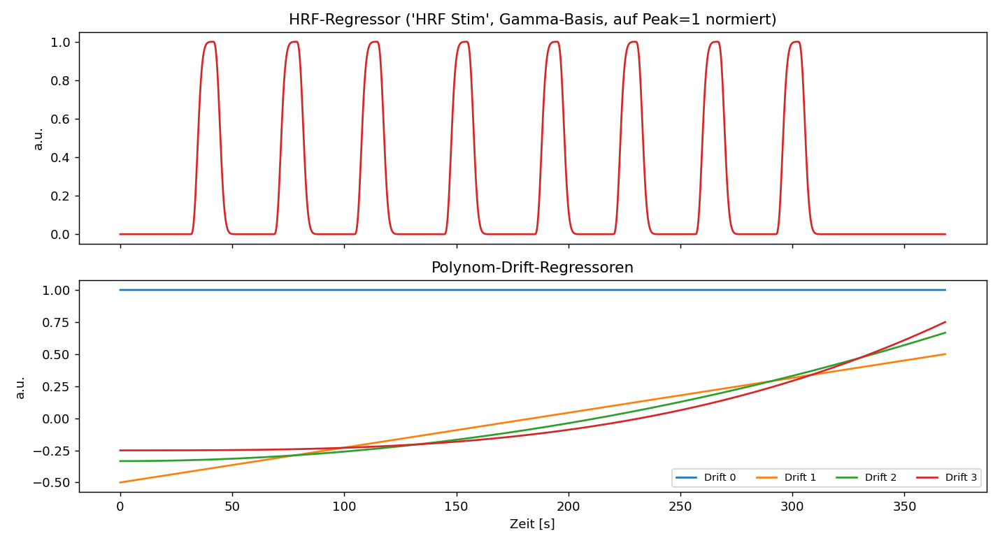
*Abb. 1 – Die Designmatrix (das „Rezept"). Oben die HRF-Zutat: die auf Höhe 1 normierte
Standardwelle, an jedem Stimulus wiederholt. Unten die Polynom-Drift-Zutaten, mit denen das
langsame Wegwandern der Grundlinie nachgebildet wird.*

### Schritt 6 – Das GLM lösen (schätzen)
Das GLM bestimmt die Mischungsverhältnisse aller Zutaten – insbesondere das geschätzte **β̂**
(sprich „beta-Dach") je Kanal. Wir nutzen das robuste Verfahren **AR-IRLS**.
*(Cedalion: `cedalion.models.glm.fit(..., noise_model="ar_irls")`, Ergebnis-Auslesen mit
`.sm.params`; Notebooks `modeling/32` und `35`.)*

### Schritt 7 – Vergleichen: Wie gut wurde die Wahrheit getroffen?
Für jeden aktiven Kanal vergleichen wir das geschätzte β̂ mit dem eingemischten wahren β und
berechnen **Bias, Varianz und RMSE** – getrennt für HbO und HbR. Zusätzlich prüfen wir die
**HbO/HbR-Plausibilität** (ist HbR etwa −0,4-mal HbO, wie eingemischt?).

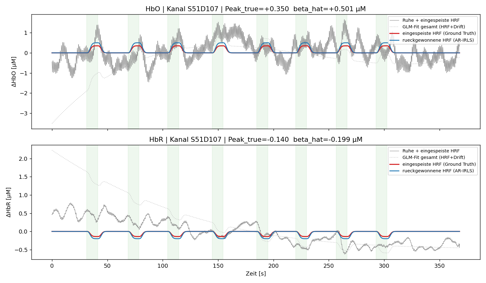
*Abb. 2 – Ein einzelner Kanal über die Zeit. Grau: gemessenes Ruhesignal mit eingemischter
Aktivität. Rot: die eingemischte Wahrheit (Ground Truth). Blau: die vom GLM zurückgewonnene
HRF. Gepunktet: der Gesamt-Fit inklusive Drift. Grüne Streifen markieren die Stimulus-Zeiten.
Dass die blaue Kurve der roten Wahrheit folgt, zeigt: die Aktivität wird zurückgewonnen.*

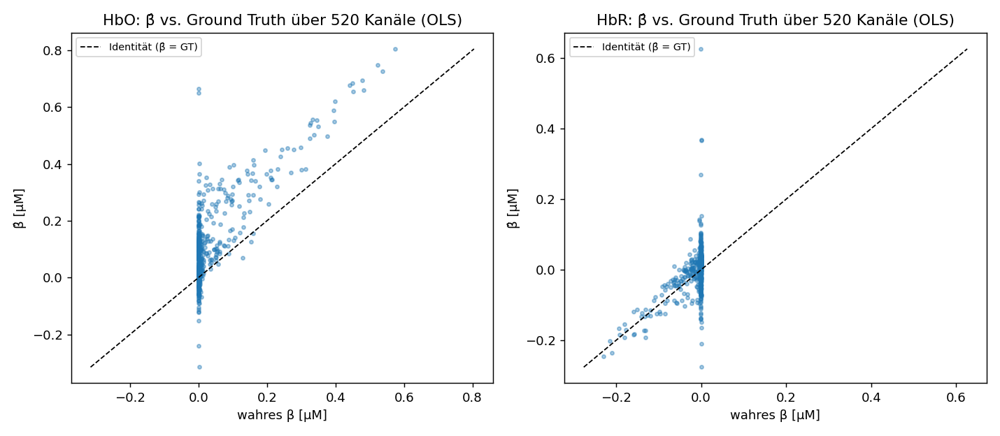
*Abb. 3 – Geschätzte gegen wahre Aktivierungsstärke, ein Punkt je Kanal. Die gestrichelte
Linie ist die Ideallinie (Schätzung = Wahrheit). Punkte darüber = Überschätzung. Bei HbO
liegen die aktiven Kanäle überwiegend oberhalb → systematische Überschätzung. Die vielen
Punkte bei „wahres β ≈ 0" sind inaktive Kanäle (reines Rauschen).*

### Schritt 8 – Bilder zeichnen
Zur Kontrolle erzeugt `drift_glm/reports/demo_figures.py` Diagramme, u. a. **Kopf-Karten (scalp plots)**, auf
denen jeder Kanal an seiner Position auf dem Kopf farbig dargestellt wird (z. B. „wie weit
lag die Schätzung daneben?").
*(Cedalion: `cedalion.vis.anatomy.scalp_plot(...)`; Vorbild Notebook `tutorial/7` und
`modeling/32`.)*

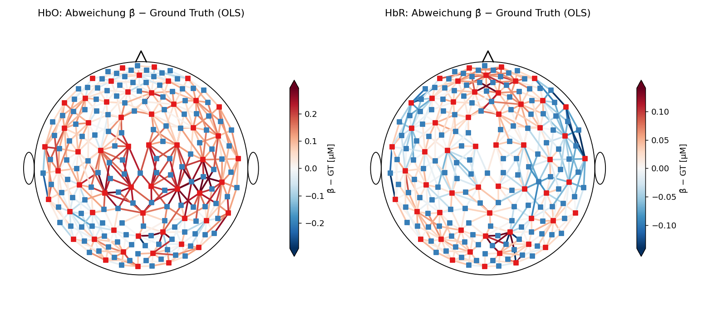
*Abb. 4 – Kopf-Karte des Schätzfehlers (β̂ − Wahrheit) je Kanal, getrennt für HbO und HbR.
Jeder Kanal ist an seiner Position auf dem Kopf eingezeichnet; die Farbe zeigt die Abweichung
(blau = zu niedrig, rot = zu hoch, weiß = korrekt). Rote/blaue Quadrate sind die Sender/
Empfänger auf dem Kopf.*

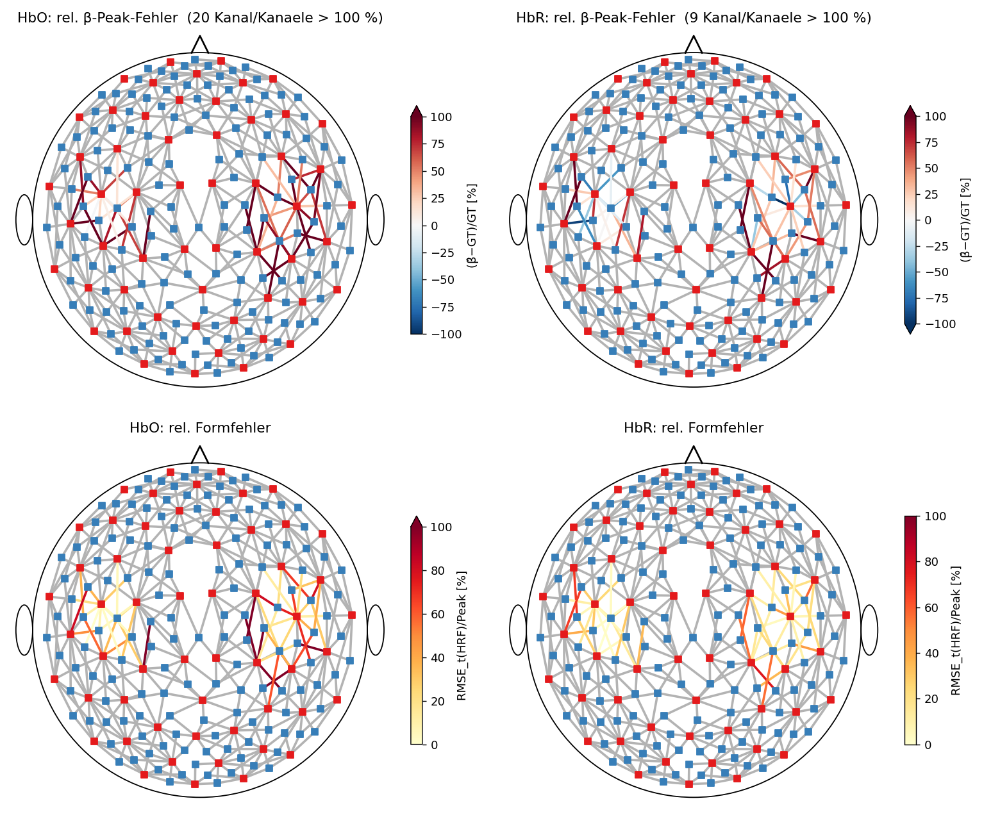
*Abb. 5 – Relative Abweichung, nur in der aktiven Region gezeigt (graue Kanäle liegen
außerhalb der Aktivierung). Oben: relativer Fehler der Amplitude; unten: ein Formfehler-Maß.
Die Farbskala ist fest auf ±100 % begrenzt; wie viele Kanäle darüber liegen, steht im Titel.*

> **Warum hier 67 % stehen und im Sweep 21 %.** Beide Zahlen sind richtig, sie beziehen sich
> auf verschiedene Kanäle. Der Sweep wertet die **20 am stärksten aktivierten** Kanäle aus –
> dort ist die eingemischte Stärke 0,6 µM, und ein Fehler von 0,12 µM sind 21 %. Diese
> Kopf-Karte zeigt **alle** Kanäle, in denen überhaupt etwas eingemischt wurde, also auch den
> Rand des Flecks. Dort beträgt die Wahrheit nur noch 0,06 µM – derselbe absolute Fehler ist
> dann 200 %. Der Median über alle diese Kanäle liegt bei 67 % (HbO) bzw. 39 % (HbR).
>
> Am Rand ist also nicht die Methode schlechter, sondern die Bezugsgröße kleiner. Für die
> Bewertung der Driftfamilien zählt der Blob-Kern (Kapitel 5/6); diese Karte zeigt, **wo** im
> Feld der Fehler sitzt – und das ist am Rand, wie erwartet.*

---

## 5. Der systematische Vergleich (der „Sweep")

Ein einzelner Durchlauf beantwortet die Forschungsfrage noch nicht. Dafür wiederholen wir
die Schritte 4–7 **systematisch für alle Kombinationen** von Einflussgrößen. Das erledigt
`drift_glm/analysis/sweep.py`. „Sweep" heißt sinngemäß „alles einmal durchfahren".

Variiert werden sechs Achsen:
1. **Driftregressor-Familie** (die Hauptfrage): 15 Varianten – Polynom Ordnung 1–5, DCT mit
   3 Grenzfrequenzen, Legendre Ordnung 1/3/5, **B-Splines** (5 und 8 Knoten), „kein Drift",
   Butterworth-Hochpass. Dazu als Filter-Alternativen Tiefpass 0,5 Hz und Bandpass
   0,01–0,5 Hz.
2. **Fensterlänge:** Wie lang ist der ausgewertete Zeitausschnitt? (90 s, 180 s und 368 s =
   die ganze Aufnahme.) Kürzere Fenster sind schwieriger.
3. **Konstellation:** Welche *weiteren* Zutaten sind im Rezept? – `baseline` (nur HRF+Drift),
   `motion` (Bewegungssignale aus dem eingebauten Beschleunigungssensor), `global`
   (ein „Gesamtsignal"-Regressor als Ersatz für systemische Störungen) sowie **echte
   Short-Channel-Regression** in zwei Varianten: `short_avg` (Mittel aller kurzen Kanäle)
   und `short_maxcorr` (je langem Kanal der am stärksten mit ihm korrelierende kurze).
4. **Bewegungskorrektur:** `wavelet` oder `tddr+wavelet`. Warum das eine eigene Achse ist,
   steht im Kasten in Kapitel 4, Schritt 2 – kurz: die beiden Verfahren gehen völlig
   unterschiedlich mit dem Driften *und* mit der Hirnantwort um.
5. **Schätzverfahren:** `ar_irls` (das Standardverfahren dieser Arbeit) und `ols` (das
   einfache Verfahren ohne Rauschmodell). AR-IRLS ist rund 50-mal langsamer, die Achse
   kostet also fast nichts.
6. **Zufalls-Wiederholungen (Seeds):** Die künstlichen Reize werden zu leicht anderen
   Zeitpunkten platziert (mehrere Wiederholungen). Erst der Vergleich **über diese
   Wiederholungen** liefert eine echte Bias-/Varianz-Aussage (nicht der Vergleich über Kanäle).

Das ergibt in der Hauptversion (v4) 15 × 3 × 5 × 2 × 4 = **1800 Auswertungen** in 7,5 Stunden.
Ergebnisse landen in `results/` (Tabelle `sweep_summary.csv`, Rohdaten
`sweep_per_channel.nc`), Abbildungen und Markdown-Tabellen erzeugt `drift_glm/reports/sweep_report.py`.

**Zu den kurzen Kanälen.** Ein Kanal mit kleinem Abstand zwischen Sender und Empfänger hat
eine flache „Lichtbanane": sein Licht erreicht das Gehirn gar nicht und misst nur Kopfhaut
und Schädel – also **systemische Störungen ohne Hirnsignal**. Nimmt man ihn als Regressor
auf, lässt sich dieser Anteil aus den langen Kanälen herausrechnen; ausgewertet wird dann
nur über die langen. Der Ruhedatensatz hat keine echten Short-Separation-Kanäle (< 10 mm),
aber bei einer Grenze von **1,8 cm** fallen 37 der 520 Kanäle in die kurze Gruppe
(15,8–17,8 mm). Genau diese Grenze war die Vorgabe aus dem Betreuungsgespräch; dasselbe
Vorgehen nutzt das Cedalion-Workshop-Notebook 36 mit 22,5 mm. **Als Einschränkung zu nennen:**
15,8–17,8 mm sehen noch etwas Kortex, der Regressor entfernt also potenziell auch echtes
Signal. Die Grenze ist außerdem nicht unempfindlich – bei 1,9 cm wären es schon 114 Kanäle.

Damit der Vergleich fair ist, wird die künstliche Aktivität **nicht in die kurzen Kanäle
eingemischt** (sie sehen ja kein Gehirn). Ohne diese Vorsichtsmaßnahme enthielte der
Short-Channel-Regressor die Hirnantwort selbst und würde sie aus den langen Kanälen
herausrechnen – gemessen bekämen die kurzen Kanäle sonst bis zu 0,54 µM der eingemischten
0,60 µM ab.

> **Wichtiger methodischer Hinweis (aus dem Betreuungsgespräch):** Bei Auswertungen *mit*
> Driftregressoren wird das Signal **nicht** hochpassgefiltert – ein Hochpassfilter würde
> genau den Drift entfernen, den die Regressoren modellieren sollen, und den Vergleich
> verfälschen. Der Butterworth-Hochpass ist deshalb die **eigenständige Alternative**
> (Filter *statt* Regressoren), nicht zusätzlich.

### Zusatz-Analyse 1: Formfehler mit flexibler Formvorlage

Bisher nutzen Einmischung und Auswertung dieselbe HRF-Formvorlage (die Gamma-Welle). Dadurch
kann sich zwischen „eingemischt" und „geschätzt" nur die **Höhe** unterscheiden, nicht die
**Form**. Um zu prüfen, ob eine schlechte Drift-Modellierung auch die *Form* der geschätzten
Antwort verzerrt, wird zusätzlich mit einer **flexiblen** Formvorlage ausgewertet
(`GaussianKernels` – eine Reihe von Glockenkurven, die zusammen praktisch jede Kurvenform
annehmen können). Als Maß dient die **Form-Treue**: die Korrelation zwischen zurückgewonnener
und eingemischter HRF-Kurve. Diese ist *skaleninvariant* – sie misst also reine Form,
unabhängig von der Höhe (1,0 = perfekte Form). Skript: `drift_glm/analysis/flex_basis.py`.
*(Cedalion: `glm.GaussianKernels`; HRF-Formvorlagen aus Notebook `modeling/31`.)*

### Zusatz-Analyse 2: Statistische Absicherung – Signifikanz und Mehrfachvergleichs-Korrektur

Für die spätere Auswertung echter Daten – und als methodische Vollständigkeit – wird die
statistische Absicherung demonstriert: Für jeden Kanal wird geprüft, ob die geschätzte
Aktivierung **statistisch signifikant** von null verschieden ist (Signifikanz = Schätzung
geteilt durch ihren Standardfehler, daraus ein p-Wert). Weil **sehr viele Kanäle gleichzeitig**
getestet werden, muss für **multiples Testen korrigiert** werden (Verfahren Benjamini-Hochberg,
„FDR", Niveau 5 %) – sonst entstünden allein durch Zufall zahlreiche Falsch-Positive.

Da wir in der Simulation die Wahrheit kennen (welche Kanäle wirklich aktiv sind = der Blob),
lässt sich die **Detektionsgüte** direkt messen:
- **Sensitivität** – Anteil der wirklich aktiven Kanäle, die auch erkannt werden;
- **Spezifität** – Anteil der Ruhe-Kanäle, die korrekt als inaktiv gelten;
- **Youden-J** (= Sensitivität + Spezifität − 1) als Gesamtmaß.

So zeigt sich, welche Driftfamilie die zuverlässigste Aktivierungs-Erkennung liefert. Dieses
Skript (`drift_glm/analysis/detection.py`) fittet über **alle** 544 Kanäle (nur so sind Falsch-Positive
bewertbar) und demonstriert damit die komplette Inferenz-Pipeline für die realen DOT-Daten.
*(Cedalion: `.sm.params` + `.sm.regressor_variances()`; FDR über `statsmodels`.)*

---

## 6. Was bisher herausgekommen ist

### Teil A – Simulation (bekannte Wahrheit)

Die Simulationsstudie lief in vier Ausbaustufen. **v1** mischte die Aktivität überall gleich
stark ein (räumlich „flach") – das führte zu einem Trugschluss beim Global-Regressor und wurde
in **v2** durch den räumlichen Blob behoben. **v3** ergänzte B-Splines, lange Fenster und die
beiden Zusatz-Analysen. **v4** ist der aktuelle Stand: 15 Driftfamilien × 3 Fenster ×
5 Konstellationen (jetzt mit echter Short-Channel-Regression) × 2 Bewegungskorrekturen ×
4 Wiederholungen = **1800 Auswertungen** in 7,5 Stunden. Die folgenden Zahlen stammen aus
**v4**. Alle Tabellen dazu: `results/tables.md`.

**Ergebnis 1 – Systemische Störungen sind der größte Hebel (für HbO).**
Ohne systemischen Regressor wird HbO deutlich **überschätzt** (Bias +0,104 µM auf eine
Wahrheit von 0,600 µM bei 90-s-Fenstern sogar +0,570). Ein systemischer Regressor bringt das
weitgehend in Ordnung. Grund: Benachbarte aktive Kanäle teilen sich systemische Körpersignale
(z. B. Blutdruckwellen); ein reines Drift-Modell zieht diese teils fälschlich in die
Hirnaktivität. → **Der systemische Regressor wirkt sich stärker aus als die Wahl der
Driftfamilie.** Bewegungs*regressoren* aus dem Beschleunigungssensor bleiben dagegen praktisch
ohne Wirkung – erwartet, da die *synthetische* HRF nicht mit echter Bewegung koppelt.

**Ergebnis 1b – Short-Channel-Regression schlägt den Global-Regressor, auch wenn die Zahlen
zunächst das Gegenteil sagen.** Rein nach Bias sieht `global` besser aus (+0,021 gegen +0,056
bei `short_avg`). Das ist aber kein Vorteil, sondern eine Verrechnung zweier Fehler: der
Global-Regressor mittelt über **alle** Kanäle, also auch über die aktivierten, und enthält
dadurch im Mittel **0,040 µM der eingemischten Hirnantwort** – die kurzen Kanäle enthalten
konstruktionsbedingt **0,000 µM**. Der Unterschied im Bias beträgt 0,035 µM, der Hirnsignal-
Anteil des Global-Regressors 0,040 µM: er „gewinnt", indem er einen Teil des Gesuchten
wegrechnet. **`short_avg` ist der methodisch saubere Regressor.**

**Ergebnis 2 – HbR ist unempfindlicher als HbO.** Der HbR-Fehler (~0,07 µM) ändert sich über
alle Konstellationen kaum – HbR ist weniger von systemischen Störungen betroffen (physiologisch
plausibel, eigenständiges Ergebnis).

**Ergebnis 3 – Die Fensterlänge dominiert.** HbO-RMSE (baseline, Wavelet): **90 s ≈ 0,30 →
180 s ≈ 0,21 → 368 s ≈ 0,09 µM** – die ganze Aufnahme ist rund dreimal genauer als ein
90-s-Fenster. Mehr Daten (und mehr Reize im Fenster) → stabilere Schätzung.

**Ergebnis 4 – Familienwahl: kontextabhängig, insgesamt moderat.**
- **Lange Fenster (368 s):** Alle Driftregressor-Familien rücken eng zusammen (HbO-RMSE
  0,119–0,125). → *Dass* ein Drift-Modell da ist, zählt; *welche* Familie, kaum.
- **Kurze Fenster (90 s):** Hier trennen sich die Familien; **sehr hohe Ordnungen überanpassen**
  (B-Spline mit 8 Knoten fällt auf 0,619 gegenüber 0,49–0,52 der übrigen).
- **B-Splines** liegen ansonsten gleichauf mit Polynom/Legendre/DCT – kein Vor-, kein Nachteil.

**Ergebnis 4b – Die Bewegungskorrektur ist wichtiger als die Driftfamilie, und sie ist eine
Falle.** TDDR halbiert den HbO-Fehler (RMSE 0,136 gegen 0,199) und beseitigt scheinbar den
Bias (−0,040 gegen +0,070). Das ist aber wieder keine bessere Schätzung, sondern die
Verrechnung zweier Fehler: TDDR **dämpft die eingemischte Hirnantwort auf 70 %** ihrer Höhe,
und diese Dämpfung hebt die systemisch bedingte Überschätzung zufällig auf. Sichtbar wird das
an **HbR**, wo es keine Überschätzung zu kompensieren gibt – dort verschlechtert TDDR den
Fehler von +0,020 auf +0,057, also von 8 % auf 24 % Betragsunterschätzung. Über alle
Driftfamilien hinweg ist der Bias praktisch identisch; der Sprung kommt allein von der
Vorverarbeitung (Abb. 14).

**Konsequenz für die Auswertung:** Bias **getrennt nach HbO und HbR** betrachten, nicht nur
den RMSE. Wer nur den RMSE ansieht, hält TDDR für das bessere Verfahren.

**Ergebnis 5 – Plausibilität.** Das zurückgewonnene HbR/HbO-Verhältnis liegt bei −0,25 bis
−0,34 (eingemischt −0,4); es bessert sich mit systemischem Regressor und mit längerem Fenster
(368 s: −0,342) und verschlechtert sich leicht mit TDDR – konsistent mit dessen HbR-Dämpfung.

**Ergebnis 6 – Die Form der HRF wird treu zurückgewonnen (Zusatz-Analyse 1).** Mit der
flexiblen Formvorlage ist die **Form-Treue hoch (~0,87–0,91) und über die Driftfamilien
ähnlich** → die Drift-Wahl verzerrt die *Form* der geschätzten Antwort nur wenig (die *Höhe*
schon, s. Ergebnis 1/5). Nebenbefund: die flexible Basis **überschätzt die Amplitude**
(+30–70 %) – der bekannte Bias-Varianz-Preis flexibler HRF-Modelle.

**Ergebnis 7 – Aktivierungs-Detektion nach FDR (Zusatz-Analyse 2).** Über alle 544 Kanäle mit
FDR-Korrektur (q = 0,05): **moderate Drift-Modelle detektieren am besten** (Youden-J HbO/HbR:
DCT 0,01 ≈ Polynom 3 ≈ Legendre 3 ≈ B-Spline 5), „kein Drift" hat die höchste **Spezifität**
(wenige Falsch-Positive), aber die niedrigste **Sensitivität** (verpasst echte Aktivierungen).
Die Inferenz-Pipeline (Signifikanz + FDR) steht damit bereit für die realen Daten.

### Teil B – Reale Daten (keine Wahrheit bekannt)

Stufe 2 der Arbeit läuft auf einem öffentlichen Finger-Tapping-Datensatz (Khan, Nazeer &
Mirtaheri 2026): **25 Probanden**, 69 Aufnahmen, 48 Kanäle, Einzelfinger-Tapping der rechten
Hand, 10 s Block gegen 10 s Ruhe, 15 Tapping-Blöcke je Aufnahme. Ausgewertet wurden
14 Driftfamilien × 2 Konstellationen × 2 Schätzverfahren über alle Aufnahmen =
**3864 Auswertungen** in 3,6 Stunden (`drift_glm/analysis/realglm.py`).

**Der entscheidende Unterschied:** Hier gibt es **keine Ground Truth**. Der Fehler gegen die
Wahrheit, an dem in der Simulation alles hing, existiert nicht. Stattdessen drei Kriterien,
die ohne Wahrheit auskommen – und eines davon trägt die Hauptlast:

> **Reproduzierbarkeit.** Die Probanden haben je 2–3 Durchgänge. Die Korrelation der
> β-Karten zwischen den Durchgängen **eines** Probanden misst, wie stabil eine Driftfamilie
> schätzt. Eine Familie, die Rauschen als Aktivierung modelliert, ist zwischen Durchgängen
> inkonsistent. Über 74 Durchgangspaare gemittelt ist das ein belastbares Gütemaß.

**Ergebnis 6 – Den Drift zu modellieren schlägt ihn wegzufiltern.** Der Butterworth-Hochpass
ist die **schlechteste** Option (Reproduzierbarkeit 0,443 mit AR-IRLS) – schlechter als *gar
kein* Driftmodell (0,494). Das bestätigt den methodischen Hinweis aus dem Betreuungsgespräch
jetzt an echten Daten statt nur als Argument.

**Ergebnis 7 – DCT mit ~0,02 Hz ist die stabilste Familie**, und zwar unabhängig vom
Schätzverfahren (0,566 mit AR-IRLS, 0,564 mit OLS). Danach DCT 0,01 (0,545/0,547) und
B-Spline 8 (0,535/0,535). Die Simulation hatte DCT ~0,01–0,02 Hz ebenfalls vorn – die beiden
Stufen der Arbeit stützen sich gegenseitig.

**Ergebnis 8 – Das Driftmodell zählt bei OLS mehr als bei AR-IRLS.** Spannweite der
Reproduzierbarkeit über die Familien: **0,200 bei OLS gegen 0,123 bei AR-IRLS**. AR-IRLS
fängt einen Teil der niederfrequenten Struktur über sein Rauschmodell ab und ist dadurch
robuster gegen eine schlechte Driftwahl. Bei OLS trägt allein die Designmatrix – dort bricht
`poly:3` auf 0,440 ein, während `dct:0.02` bei 0,564 bleibt.

**Ergebnis 9 – Tiefpassfilterung und AR-IRLS schließen einander aus.** Mit einem Tiefpass bei
0,5 Hz kollabiert die Schätzung auf **1e-05 µM**, fünf Größenordnungen zu klein; mit OLS
liefert derselbe Datensatz normale Werte, und ein reiner Hochpass läuft mit AR-IRLS
problemlos. Ursache ist die Prewhitening-Stufe: AR-IRLS schätzt ein Rauschmodell und wendet
dessen Inverse an. Bei 3,906 Hz Abtastrate entfernt ein Tiefpass bei 0,5 Hz rund **drei
Viertel des Spektrums** (0,5 Hz = 0,256 × Nyquist); oberhalb davon hat das Residuum keine
Leistung mehr, der Whitening-Filter müsste dort unendlich verstärken. Übrig bleibt
numerisches Rauschen. **Das ist kein Rechenfehler, sondern eine Eigenschaft der Kombination**
– und sie hängt an der Abtastrate: auf dem 9-Hz-Ruhedatensatz läge 0,5 Hz bei 0,51 × Nyquist
und wäre weit unkritischer.

**Ergebnis 10 – Plausibilität auf realen Daten.** HbO und HbR sind mit **−0,88** deutlich
antikorreliert, das Signal ist also physiologisch. Das HbR/HbO-Verhältnis liegt bei −0,18
(baseline) und verbessert sich mit dem systemischen Regressor auf −0,29 (AR-IRLS) bzw. −0,36
(OLS); erwartet wird ~−0,4. Der systemische Regressor halbiert dabei die Zahl signifikanter
Kanäle (27–31 → 10–19 von 48) – dasselbe Muster wie in der Simulation.

### Teil C – Im Bildraum (Version 5)

Hier wird eine Frage gestellt, die im Kanalraum gar nicht formulierbar ist: **landet die
Aktivierung am richtigen Ort auf dem Kortex?** Ein Kanal ist ein Quell-Detektor-Paar, keine
Hirnregion; erst die Rückrechnung in den Bildraum liefert einen Ort. Sie ist ein *inverses
Problem* – viele Hirnbilder erklären dieselben Kanalwerte, man braucht Zusatzannahmen
(Regularisierung), um eines auszuwählen.

**Ergebnis C1 – Ohne Sichtbarkeitsmaske ist im Bildraum keine Zahl brauchbar.**
Die Rekonstruktion gibt für **jeden** Punkt der Hirnoberfläche einen Wert zurück, auch für
solche, zu denen nie ein Photon gelangt ist. Dort ist das Ergebnis kein Messwert, sondern
reine Regularisierung – und die Tiefenkorrektur verstärkt genau diese Punkte am stärksten,
weil sie durch die (kleine) örtliche Empfindlichkeit teilt. Gemessen: ohne Maske landet
selbst die **rauschfreie Wahrheit** 65–110 mm neben ihrem eigenen Zentrum, bei einer
Korrelation von 0,00. Mit Maske (Punkte über 1 % der maximalen Empfindlichkeit) sind es
r = 0,80 und 11,9 mm. *Das ist keine Feinheit der Auswertung, sondern die Voraussetzung
dafür, dass sie überhaupt etwas misst.*

**Ergebnis C2 – Die Regularisierung entscheidet mehr als das Rauschmodell.** Rauschfrei
geprüft (`python -m drift_glm.core.imagespace check`) hängt der Ortsfehler praktisch nur an einem
Parameter, `alpha_spatial`; der zweite (`alpha_meas`) verschiebt ihn kaum. Auf der dünnen
28-Kanal-Montage:

| `alpha_spatial` | Korrelation | Amplitude (Ist/Soll) | Ortsfehler |
|---|---|---|---|
| aus | +0,49 … +0,58 | 1,36 – 1,51 | **8,6 mm** |
| 0,001 (Vorgabe) | +0,45 … +0,51 | **1,82 – 2,02** | 14,6 mm |
| 0,01 | **+0,59 … +0,65** | **0,89 – 0,97** | 13,2 – 14,0 mm |

Der vorgegebene Wert 0,001 schneidet also am schlechtesten ab – er überschätzt die
Amplitude um den Faktor 2. Er bleibt trotzdem die Voreinstellung (Betreuungsvorgabe wird
nicht stillschweigend übersteuert), der Gegenlauf ist ein Argument. Auf der dichten
520-Kanal-Montage ist der Unterschied kleiner, aber gleichgerichtet (0,001 → 11,9 mm;
0,01 → 3,0 mm).

**Ergebnis C3 – Der Bildraum ist ein strengeres Gütekriterium als der Kanalraum.**
Damit die Zahlen einordbar sind, läuft eine **rauschfreie Obergrenze** mit: die wahre
Kanalkarte durch denselben Rückweg (r = 0,80 / 11,9 mm auf dem Ruhedatensatz). In der
ungünstigsten Konfiguration – einfaches Schätzverfahren, kurzes Fenster, **ohne**
systemischen Regressor – erreicht die Schätzung dagegen r ≈ 0,00 und 65–110 mm. Im
Kanalraum sah dieselbe Schätzung unauffällig aus (RMSE 0,21 µM bei 0,6 µM Peak).

> Eine im Kanalraum akzeptable Schätzung kann im Bildraum vollständig danebenliegen, weil
> die Rekonstruktion die Fehler über ganze Lichtwege verteilt. Der Bildraum ist damit
> **kein zusätzlicher Darstellungsschritt, sondern ein härteres Kriterium.**

**Ergebnis C4 – Die „Konzentration" eines kurzen Kanals ist keine Amplitude.** Ein
Fallstrick, der still falsche Zahlen erzeugt. Die Umrechnung von optischer Dichte in
Konzentration teilt durch den Quell-Detektor-Abstand; bei 7,3 mm gegen 37 mm ist dieser
Nenner fünfmal kleiner, dieselbe optische Dichte wird also zu einer fünfmal größeren
Konzentration. Auf der 28-Kanal-Montage lag das globale Maximum der Kanalraum-Wahrheit
dadurch auf einem **7,3-mm-Kanal** (0,600 µM) vor dem besten langen (0,231 µM) – obwohl
dessen Hirn-Empfindlichkeit 230-mal größer ist. Die Amplituden-Kalibrierung greift deshalb
nur auf Kanäle zu, die mindestens 10 % der maximalen Hirn-Empfindlichkeit haben.

**Ergebnis C5 – Die „kurzen" Kanäle des Ruhedatensatzes sind keine reinen
Systemik-Messungen.** Mit der Einmischung auf dem Kortex ist das beziffert statt behauptet:
der stärkste 15,8–17,8-mm-Kanal bekommt **18,9 % des eingemischten Peaks** ab. Im
gemittelten Regressor bleiben davon 1,4 % (Short-Average) gegen 3,8 % (Global-Mittelwert) –
derselbe Befund wie in Ergebnis 3, aber jetzt mit physikalisch abgeleitetem Muster statt der
künstlich auf Null gesetzten kurzen Kanäle der Vorversion.

### Nutzungsempfehlung (Stand: beide Stufen)

1. **Systemischen Regressor verwenden** – der größte Genauigkeits-Hebel für HbO. Wenn die
   Montage kurze Kanäle hat, **Short-Channel-Regression** statt Global-Mittelwert: der
   Global-Regressor enthält das gesuchte Signal mit und rechnet es teilweise weg.
2. **Möglichst lange Auswertefenster.**
3. **Beim Drift: DCT mit Grenzfrequenz ~0,01–0,02 Hz.** In beiden Stufen der Arbeit die
   stabilste Wahl. Sehr hohe Ordnungen bei kurzen Fenstern meiden.
4. **Den Drift modellieren, nicht wegfiltern.** Der Hochpass als Ersatz für Driftregressoren
   war auf realen Daten die schlechteste Option.
5. **Tiefpass und AR-IRLS nicht kombinieren** (Ergebnis 9).
6. **Bei der Bewegungskorrektur genau hinsehen:** TDDR dämpft die Hirnantwort auf 70 % und
   kann dadurch Fehler kaschieren, die im RMSE gut aussehen. Bias getrennt nach HbO und HbR
   prüfen.

### Abbildungen zum Hauptsweep

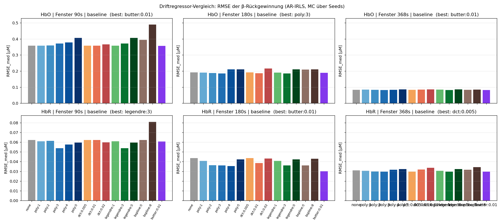
*Abb. 6 – Gesamtfehler (RMSE) je Driftregressor-Familie, für HbO (oben) und HbR (unten), je
Fensterlänge (90 / 180 / 368 s). Niedriger = besser. Sichtbar: längere Fenster sind durchweg
genauer; bei 368 s liegen die Familien eng beieinander.*

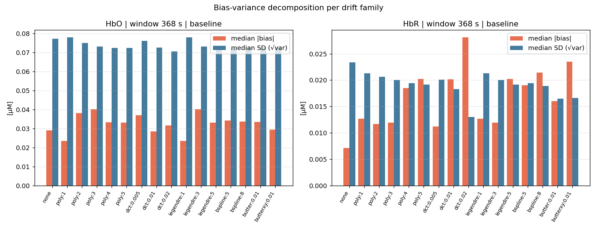
*Abb. 7 – Aufteilung des Fehlers je Familie in Bias (systematische Verzerrung) und Streuung.*

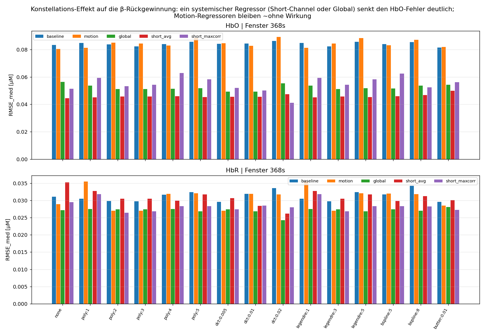
*Abb. 8 – Wirkung der Konstellation. Der Global-Regressor (grün/rot) senkt den HbO-Fehler
(oben) deutlich gegenüber baseline/motion (blau/orange). Bei HbR (unten) ist der Effekt klein.*

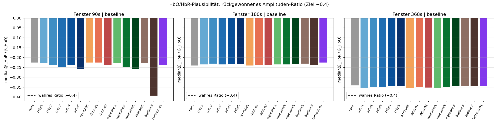
*Abb. 9 – Plausibilität: zurückgewonnenes HbR/HbO-Verhältnis je Familie; gestrichelt der wahre,
eingemischte Wert (−0,4).*

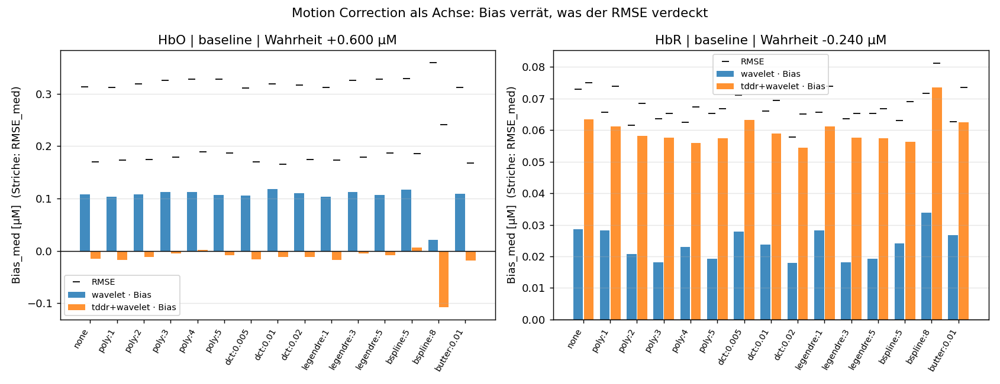
*Abb. 10 – Die Bewegungskorrektur als eigene Achse. Balken = Bias, Striche = RMSE. Links HbO,
rechts HbR. Entscheidend ist, dass der Bias über **alle** Driftfamilien praktisch konstant
bleibt – der Sprung zwischen den beiden Balkenfarben kommt allein von der Vorverarbeitung.
TDDR (orange) drückt den HbO-Bias auf null, verdreifacht ihn aber bei HbR: dort fehlt die
Überschätzung, gegen die sich die Dämpfung verrechnen könnte.*

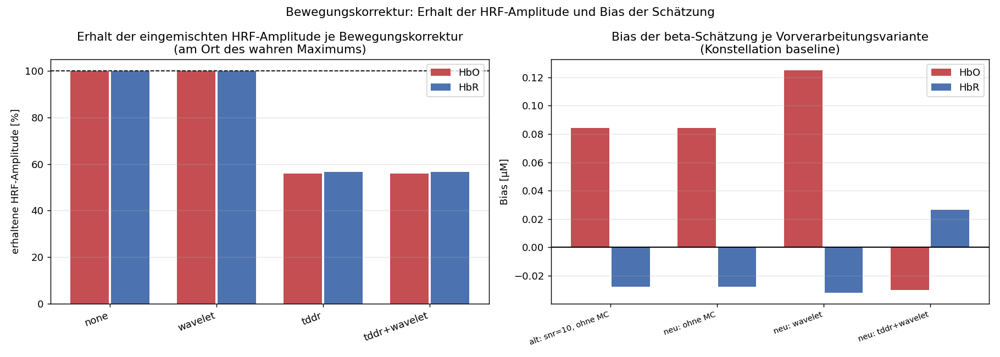
*Abb. 11 – Warum die Bewegungskorrektur eine eigene Achse ist, in einem Bild. Links: wie viel
der **eingemischten** Hirnantwort jedes Verfahren übrig lässt (100 % = unangetastet). Ohne
Korrektur ist es exakt 100 %, bei TDDR nur noch rund 70 %. Rechts: was daraus für den
Schätzfehler folgt. Der gute RMSE von TDDR entsteht dadurch, dass die Dämpfung eine
Überschätzung aufhebt – nicht dadurch, dass besser geschätzt würde.*

### Abbildungen zu den Zusatz-Analysen

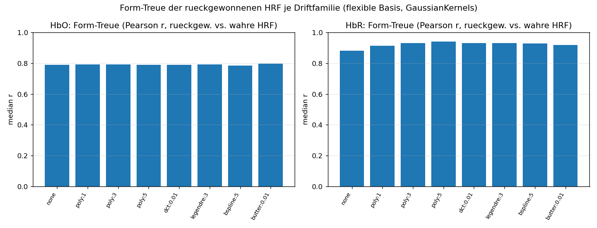
*Abb. 12 – Form-Treue (Korrelation rückgewonnene vs. injizierte HRF) je Driftfamilie, flexible
Formvorlage. Hoch und über Familien ähnlich → die Drift-Wahl verzerrt die HRF-Form kaum.*


*Abb. 13 – Beispiel: rückgewonnene HRF-Kurven (flexible Basis) je Driftfamilie gegen die
injizierte Ground-Truth-HRF (schwarz), ein Kanal.*

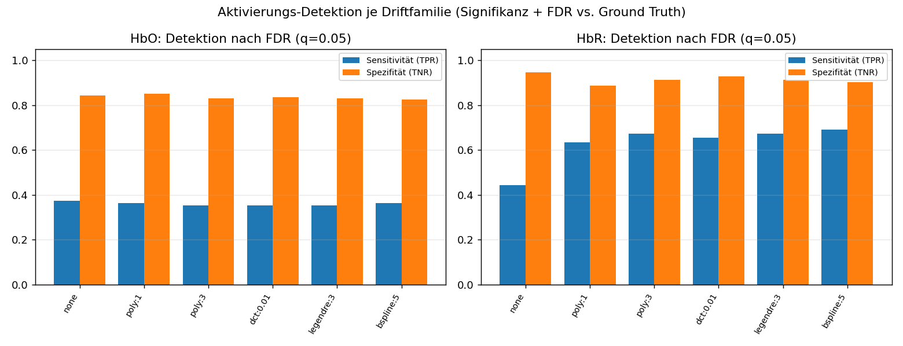
*Abb. 14 – Aktivierungs-Detektion nach FDR-Korrektur (q = 0,05) je Driftfamilie:
Sensitivität (blau) und Spezifität (orange), HbO/HbR. Moderate Drift-Modelle geben die beste
Balance; „kein Drift" ist spezifisch, aber unsensitiv.*

### Abbildungen zu den realen Daten

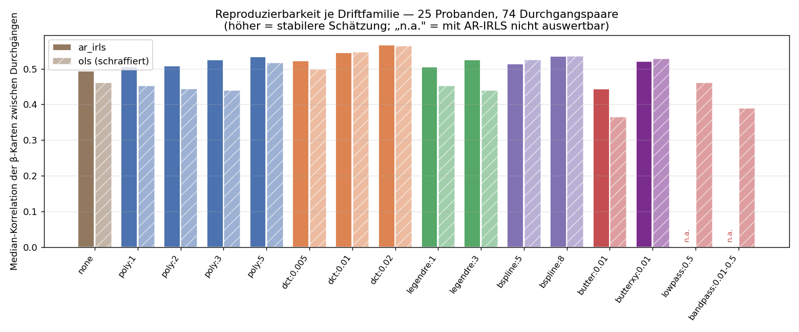
*Abb. 15 – Das Hauptergebnis der realen Daten. Median-Korrelation der β-Karten zwischen den
Durchgängen eines Probanden, über 74 Durchgangspaare. Höher = stabilere Schätzung. Die
DCT-Familie (orange) liegt vorn, die Filter-Alternativen (rot) klar hinten – schlechter als
gar kein Driftmodell (braun). „n.a." markiert die mit AR-IRLS nicht auswertbare Kombination
(Ergebnis 9).*

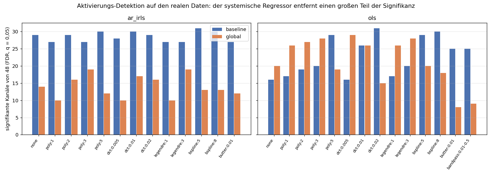
*Abb. 16 – Zahl der Kanäle, die die FDR-Korrektur überstehen (von 48). Der systemische
Regressor (orange) entfernt bei AR-IRLS rund die Hälfte der Signifikanz – dasselbe Muster
wie in der Simulation.*

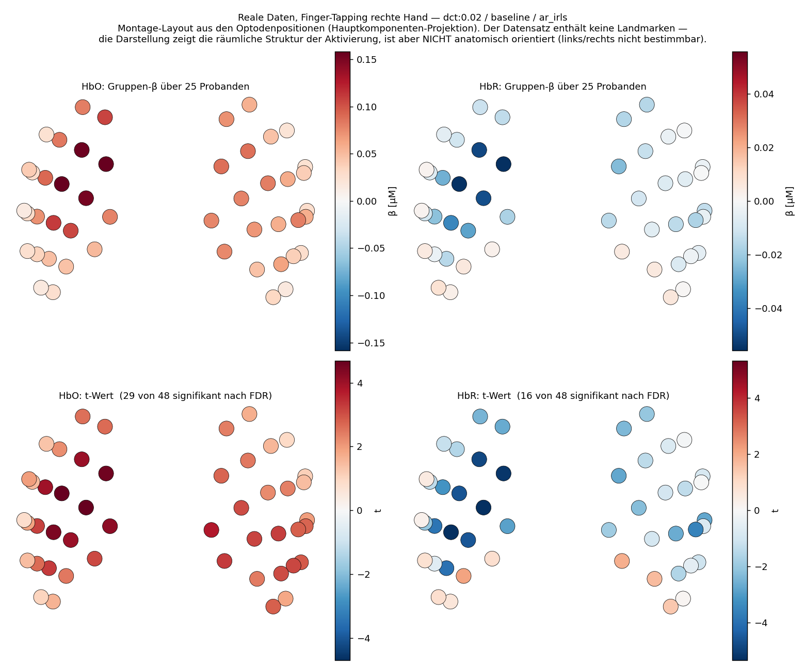
*Abb. 17 – Die eigentliche Frage: **wo** sitzt die Aktivierung? Gruppen-β über 25 Probanden
(oben) und t-Werte (unten), HbO links, HbR rechts. Erwartet wird die stärkste Antwort über
dem linken, kontralateralen Motorkortex, da mit der rechten Hand getappt wurde.*

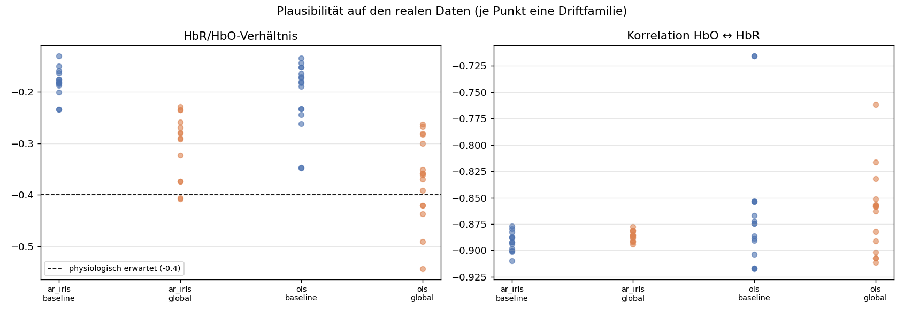
*Abb. 18 – HbR/HbO-Verhältnis (links, gestrichelt der physiologisch erwartete Wert −0,4) und
Antikorrelation zwischen HbO und HbR (rechts). Je Punkt eine Driftfamilie.*

### Abbildungen zum Bildraum und zum dritten Datensatz

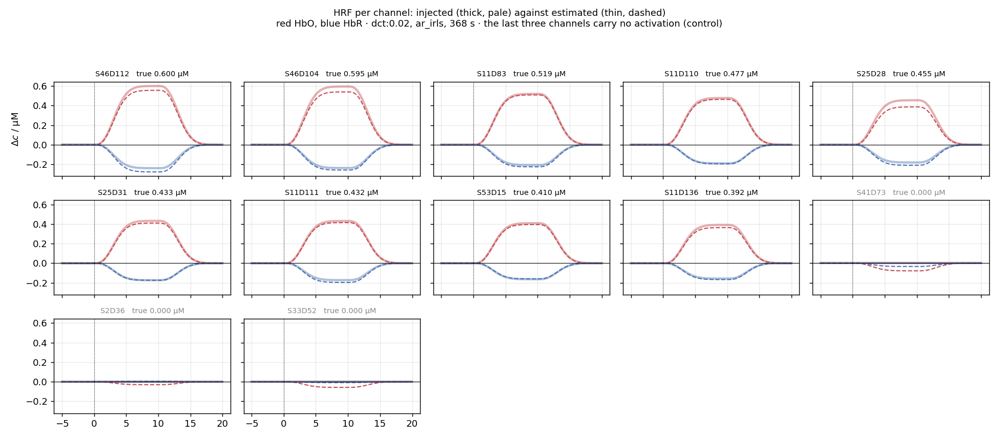
*Abb. 19 – Je Kanal die eingemischte HRF (dick und blass) gegen die geschätzte (dünn,
gestrichelt); rot HbO, blau HbR. Die letzten drei Kacheln zeigen Kanäle **ohne**
Aktivierung – dort muss die Schätzung flach bleiben. Genau diese Kontrolle verschwindet in
jeder gemittelten Kennzahl.*

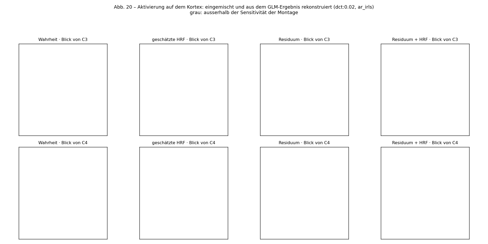
*Abb. 20 – Die Abbildung, die den Bildraum rechtfertigt: sie zeigt den **Ort**. Links die
eingemischte Wahrheit (Flecken unter C3 und C4), rechts, was aus dem GLM-Ergebnis
zurückkommt – je Spalte eine der drei Projektionen, je Zeile eine Blickrichtung. Graue
Bereiche sieht die Montage nicht; dort wäre jeder Wert reine Regularisierung.*

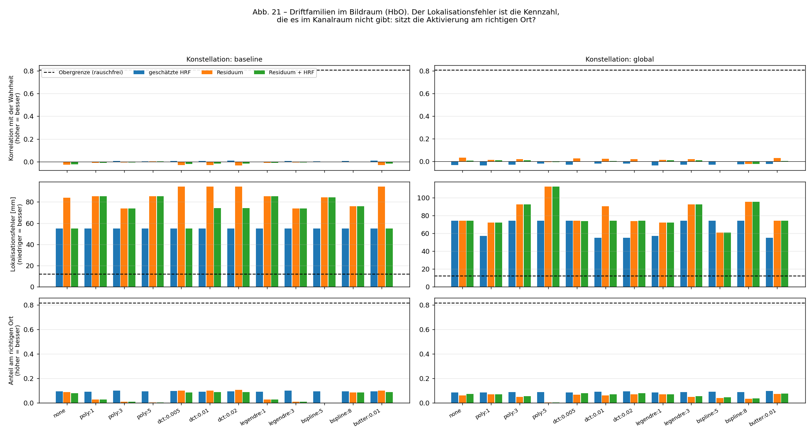
*Abb. 21 – Driftfamilien im Bildraum (HbO). Die gestrichelte Linie ist die **rauschfreie
Obergrenze**: die wahre Kanalkarte durch denselben Rückweg. Ohne sie ist kein Balken
interpretierbar – erst der Abstand zur Linie sagt, wie viel die Schätzung verliert.*

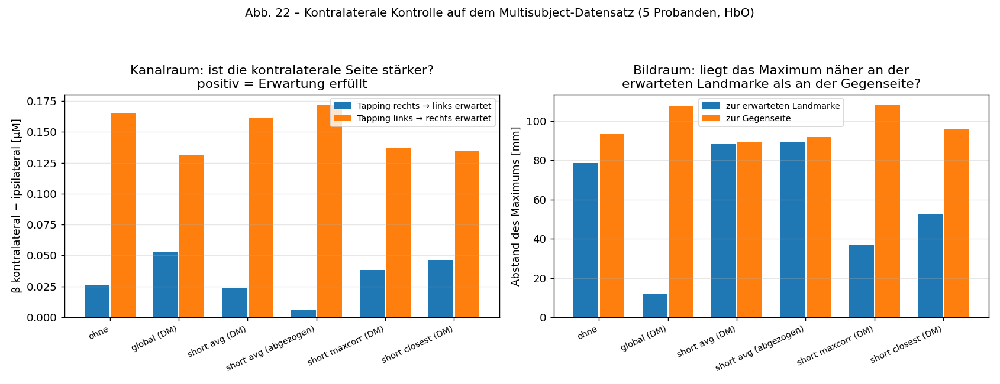
*Abb. 22 – Der dritte Datensatz erlaubt eine **überprüfbare Vorhersage ohne Ground Truth**:
Motorik ist kontralateral, also muss Tappen mit der rechten Hand links stärker sein und
umgekehrt. Links im Kanalraum (positiv = Erwartung erfüllt), rechts im Bildraum als
Abstand des Maximums zur erwarteten Landmarke gegen den Abstand zur Gegenseite.*

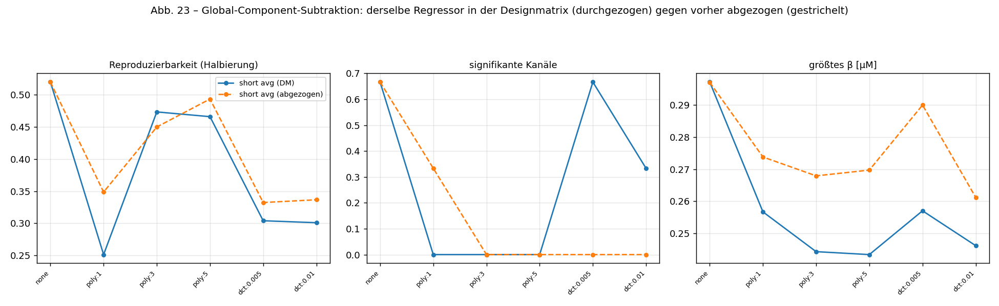
*Abb. 23 – Derselbe systemische Regressor, zwei Anwendungsarten: in der Designmatrix
belassen (durchgezogen) oder vorher abgezogen (gestrichelt). Der Unterschied ist nicht
kosmetisch – der abgezogene Anteil wird auf Daten geschätzt, die die gesuchte Antwort
enthalten.*

---

## 7. Die Dateien im Überblick

Der Code liegt im Paket `drift_glm/` mit vier Schichten. Die Abhängigkeiten laufen nur
nach unten: `reports` darf `analysis` benutzen, `analysis` darf `data` und `core`, und
`core` kennt die oberen Schichten nicht. Wer das umdreht, baut einen Importzyklus – und
der fällt sofort auf. Aufgerufen wird deshalb immer als Modul
(`python -m drift_glm.analysis.sweep`), nie als Datei; die genaue Begründung steht in
der [`README`](README.md).

| Datei | Aufgabe |
|---|---|
| `drift_glm/core/preprocess.py` | **Vorverarbeitung** (Kapitel 4, Schritt 2): OD-Umrechnung mit Baseline, Bewegungskorrektur, Rückweg zur Amplitude, Kanalmasken, Pruning, datengetriebene Amplitudengrenzen. Enthält auch die Diagnose, ob ein Verfahren ins Driftband eingreift. |
| `drift_glm/core/shortchannel.py` | **Kurze Kanäle:** Distanzanalyse, Long/Short-Split, die drei Regressor-Varianten – und die Alternative, den systemischen Anteil *abzuziehen* statt ihn im Modell zu lassen. |
| `drift_glm/core/imagespace.py` | **Bildraum-Fundament:** Kopfmodell (ICBM152), Sensitivitätsmatrix, C3/C4-Blob, Vorwärts- und Rückweg, Sichtbarkeitsmaske, Regularisierung. Einzige Stelle, an der das Kopfmodell beschafft wird. |
| `drift_glm/core/pipeline.py` | **Kernstück der Simulation.** Erzeugt die künstliche HRF als Blob auf dem Kortex, trägt sie über die Sensitivitätsmatrix in den Kanalraum, mischt sie dort in die optische Dichte ein – *vor* der Bewegungskorrektur – und baut die Designmatrix. |
| `drift_glm/analysis/imageglm.py` | **Bildraum-Auswertung:** GLM-Ergebnis (geschätzte HRF, Residuum, Residuum+HRF) zurück auf den Kortex, Gütemaße inkl. Lokalisationsfehler. |
| `drift_glm/data/multisubject.py` | **Stufe 3:** Multisubject-Fingertapping (5 Probanden, echte Short Channels), Loader, Inventar, Vorverarbeitung. |
| `drift_glm/analysis/msglm.py` | **Stufe 3, Kern:** GLM je Driftfamilie × Systemik-Stufe, Gruppen-t-Test, Halbierungs-Reproduzierbarkeit, kontralaterale Kontrolle im Kanal- und Bildraum. |
| `drift_glm/data/coregister.py` | Landmarkenfreie Koregistrierung der NIRScout-Montage auf ICBM152 – und die Dokumentation, warum daraus hier keine Sensitivitätsmatrix wird. |
| `drift_glm/reports/imagespace_report.py` | Abbildungen 19–23 (HRF je Kanal, Kortexdarstellung, Driftfamilien im Bildraum, Lateralisierung, Systemik-Achse). |
| `drift_glm/analysis/sweep.py` | Der **systematische Vergleich** über alle Kombinationen (Kapitel 5). Schreibt Ergebnisse + eine Live-Fortschrittsdatei. |
| `drift_glm/analysis/compare_preprocessing.py` | Vergleicht die Vorverarbeitungs-Varianten gegen die β-Rückgewinnung (Grundlage für Ergebnis 4b). |
| `drift_glm/data/realdata.py` | **Stufe 2:** Einlesen der realen SNIRF-Dateien, Inventar, Stimulus-Zuordnung (inkl. der abweichenden Kodierung bei S25), datengetriebene Amplitudengrenzen. |
| `drift_glm/analysis/realglm.py` | **Stufe 2, Kern:** GLM je Driftfamilie über alle Probanden, Gruppen-t-Test, FDR, Reproduzierbarkeit zwischen Durchgängen. |
| `drift_glm/reports/realglm_report.py` | Abbildungen zu den realen Daten (Abb. 14–17), inkl. der Gruppen-β-Karte auf dem Kopf. |
| `drift_glm/reports/sweep_report.py` | Erzeugt aus den Sweep-Ergebnissen die **Abbildungen** und **Markdown-Ergebnistabellen** (`results/tables.md`). |
| `drift_glm/analysis/flex_basis.py` | **Zusatz-Analyse 1:** flexible HRF-Formvorlage → Form-Treue (Formfehler unabhängig von der Höhe). |
| `drift_glm/analysis/detection.py` | **Zusatz-Analyse 2:** Signifikanz je Kanal + FDR-Korrektur → Detektionsgüte gegen die Ground Truth. |
| `drift_glm/reports/demo_recovery.py` | **End-to-end-Demo (Zahlen):** ein Durchlauf, gibt Fehlerkennzahlen aus. |
| `drift_glm/reports/demo_figures.py` | **End-to-end-Demo (Bilder):** Designmatrix, Ein-Kanal-Fit, β̂-vs-Wahrheit, Kopf-Karten. |
| `tests/` | Schnelle **Smoke-Tests** (pytest) für die Pipeline. |
| `results/` | Ausgaben: `sweep_summary.csv`, `sweep_per_channel.nc`, `tables.md`, `flex_basis_summary.csv`, `detection_summary.csv`, `logs/*_progress.txt`. |
| `figures/` | Alle erzeugten Abbildungen (PNG). |
| `environment.lock.txt` | Exakte Versionen der Kern-Pakete (Reproduzierbarkeit). |
| `README.md` | Knappe technische Ausführ-/Reproduktions-Anleitung. |
| `../cedalion/` | Cedalion-Framework (Schwester-Ordner) inkl. Beispiel-Notebooks unter `../cedalion/examples/`. |

---

## 8. Wie man alles ausführt

Vorbereitet ist eine Python-Umgebung namens `cedalion`. Alle Befehle aus diesem Repo-Ordner:

```bash
# Umgebung aktivieren (einmal pro Terminal) und in den Repo-Ordner wechseln
source ~/anaconda3/etc/profile.d/conda.sh
cd fnirs-drift-glm

# 1) End-to-end-Demo mit Zahlen (~einige Minuten)
conda run -n cedalion python -m drift_glm.reports.demo_recovery

# 2) Kontroll-Abbildungen erzeugen
conda run -n cedalion python -m drift_glm.reports.demo_figures

# 3) Schnelltests (Sekunden–Minuten)
conda run -n cedalion python -m pytest tests -q          # Smoke-Tests
conda run -n cedalion python -m drift_glm.analysis.sweep pilot              # alle Code-Pfade, ~5 min
conda run -n cedalion python -m drift_glm.analysis.flex_basis test          # ~1 min
conda run -n cedalion python -m drift_glm.analysis.detection test           # ~1 min

# 4) Hauptstudie v4 (1800 Auswertungen, ~7,5 Stunden)
conda run -n cedalion python -m drift_glm.analysis.sweep v4
#    Fortschritt live verfolgen (in einem zweiten Terminal):
cat results/logs/sweep_progress.txt

# 5) Zusatz-Analysen (schreiben ebenfalls *_progress.txt)
conda run -n cedalion python -m drift_glm.analysis.flex_basis               # ~20 min
conda run -n cedalion python -m drift_glm.analysis.detection                # ~60–75 min (Fits über ALLE Kanäle)
conda run -n cedalion python -m drift_glm.analysis.compare_preprocessing    # ~17 min

# 6) Auswertungs-Abbildungen + Ergebnistabellen erzeugen
conda run -n cedalion python -m drift_glm.reports.sweep_report
```

**Stufe 2 – die realen Daten.** Sie liegen als SNIRF unter
`../FingerTappingDataset_Published2025/` (Unterordner je Proband):

```bash
# Inventar: prüft die Angaben aus dem Paper gegen die Dateien
conda run -n cedalion python -m drift_glm.data.realdata

# Hauptauswertung (3864 Auswertungen, ~3,6 Stunden)
conda run -n cedalion python -m drift_glm.analysis.realglm
cat results/logs/realglm_progress.txt        # Fortschritt

# Abbildungen (die Kopf-Karte rechnet ~8 min nach; "quick" lässt sie weg)
conda run -n cedalion python -m drift_glm.reports.realglm_report
conda run -n cedalion python -m drift_glm.reports.realglm_report quick
```

*(Hinweis: Der Datensatz enthält zu jeder Aufnahme eine von den Autoren vorgefilterte
Fassung `*_CC_filtered.snirf`. Diese ist für den Driftregressor-Vergleich **unbrauchbar** –
sie hat den Hochpass bei 0,01 Hz bereits angewandt, also genau den Drift entfernt, um den es
geht. `realdata.find_files()` blendet sie deshalb standardmäßig aus.)*

*(Technischer Hinweis für WSL/Windows: Dateien immer aus der Linux-Umgebung heraus
bearbeiten, nicht mit nativen Windows-Werkzeugen – sonst werden durch Zeilenende-Umschreibung
scheinbar alle Cedalion-Dateien „verändert".)*

---

## 9. Was noch kommt (Ausblick)

**Beide Stufen der Arbeit sind rechnerisch abgeschlossen.** Die Simulation liegt als v4 vor
(1800 Auswertungen), die realen Daten als Gruppenanalyse über 25 Probanden (3864
Auswertungen). Was seit der letzten Fassung dazukam:

- **Vorverarbeitung nach Betreuungsvorgabe** – Bewegungskorrektur auf der optischen Dichte,
  danach zurück zur Amplitude, erst dann Kanalbewertung (Kapitel 4, Schritt 2).
- **Echte Short-Channel-Regression** bei 1,8 cm statt nur des Global-Mittelwerts.
- **Bewegungskorrektur und Schätzverfahren als eigene Achsen** – beide stellten sich als
  einflussreicher heraus als die Driftfamilie selbst.
- **Stufe 2 auf realen Daten** mit Gruppenstatistik, FDR und dem wahrheitsfreien
  Reproduzierbarkeits-Kriterium.

**Version 5 (August) – der Bildraum ist dazugekommen, und ein dritter Datensatz.** Was
zuvor als „noch offen" hier stand, ist umgesetzt:

- **Die Ground Truth liegt jetzt auf dem Kortex** (Kapitel 4, Schritt 4): ein geodätischer
  Fleck unter C3 und C4, über die Sensitivitätsmatrix in den Kanalraum getragen, dort in die
  Ruhedaten gemischt. Kopfmodell durchgängig **ICBM152**.
- **Das GLM-Ergebnis geht zurück auf den Kortex** – die geschätzte HRF, das Residuum und
  beides zusammen. Damit ist erstmals messbar, ob die Aktivierung am **richtigen Ort**
  landet (`drift_glm/analysis/imageglm.py`, Abb. 20/21).
- **Ein dritter Datensatz mit echten Short Channels**: Multisubject-Fingertapping,
  5 Probanden, 8 Kanäle bei 7,1 mm. Damit ist die Short-Channel-Regression kein reiner
  Simulationsbefund mehr, und weil beide Hände getrennt getappt wurden, gibt es eine
  **überprüfbare anatomische Vorhersage** ohne Ground Truth: kontralateral muss stärker
  sein (`drift_glm/analysis/msglm.py`, Abb. 22).
- **Die Global-Component-Subtraktion** als eigene Achse neben dem Regressor in der
  Designmatrix (Abb. 23).

**Was offen bleibt – der Bildraum für den 48-Kanal-Datensatz.** Dessen Optodendatei enthält
keine Landmarken (Nasenwurzel, Ohrpunkte). Eine landmarkenfreie Anpassung legt die Optoden
zwar im Median 2,2 mm auf die Kopfhaut (`drift_glm/data/coregister.py`), aber sie kann **links und rechts
nicht unterscheiden** – eine Kopfhaut ist dafür zu symmetrisch. Und die
Sensitivitätsmatrix selbst müsste über eine Photonensimulation berechnet werden, die eine
CUDA-GPU braucht (hier nicht vorhanden). Beides löst sich, sobald von der Betreuung eine
Koregistrierung oder eine fertige Matrix für dieses Gerät kommt.

**Abschließend – Verschriftlichung (durch den Autor):**
- Methoden-, Ergebnis- und Diskussionsteil der Bachelorarbeit; Einordnung in die Fachliteratur
  und Ableitung der finalen **Nutzungsempfehlung**, welcher Driftregressor unter welchen
  Bedingungen die zuverlässigste Schätzung liefert. (Diese Dokumentation und die
  Ergebnistabellen in `results/tables.md` liefern dafür das Material.)

---

## 10. Glossar

- **AR-IRLS** – robustes GLM-Schätzverfahren, das zeitlich „nachhallendes" Rauschen
  berücksichtigt (modelliert das Rauschen, nicht den Drift).
- **β / β̂** – wahre bzw. geschätzte Aktivierungsstärke an einem Kanal.
- **Bias** – systematische Verzerrung der Schätzung (im Mittel zu hoch/zu niedrig).
- **B-Splines** – stückweise glatte Kurvenstücke; hier eine Driftfamilie (eigene Regressorspalten).
- **Butterworth-Hochpass** – Filter, der langsames Driften vor der Auswertung entfernt;
  Alternative zu Driftregressoren.
- **Cedalion** – das verwendete Python-Framework für fNIRS/DOT.
- **DCT** – diskrete Cosinus-Basis; Driftfamilie aus Cosinus-Wellen bis zu einer Grenzfrequenz.
- **Designmatrix** – Tabelle aller „Zutaten" (Regressoren) im GLM.
- **DOT** – Diffuse Optische Tomografie; hochkanaliges fNIRS mit räumlicher Auflösung.
- **Drift** – langsames, nicht-hirnbezogenes Wegwandern der Messwerte.
- **FDR (False Discovery Rate)** – Korrektur für multiples Testen (Benjamini-Hochberg):
  begrenzt den erwarteten Anteil an Falsch-Positiven, wenn viele Kanäle gleichzeitig getestet werden.
- **Flexible Formvorlage** – HRF-Basis, deren Kurvenform frei ist (`GaussianKernels`);
  ermöglicht die Messung des Formfehlers unabhängig von der Höhe.
- **fNIRS** – funktionelle Nahinfrarotspektroskopie; Hirndurchblutungsmessung mit Licht.
- **GLM** – General Linear Model; erklärt das Signal als gewichtete Summe bekannter Zutaten.
- **Ground Truth** – der bekannte wahre Wert (in der Simulation von uns eingemischt).
- **HbO / HbR** – sauerstoffreiches / sauerstoffarmes Hämoglobin; steigen bzw. fallen bei
  Aktivierung.
- **HRF** – hämodynamische Antwortfunktion; typische Form der Durchblutungsantwort auf einen Reiz.
- **Kanal** – Messpunkt aus Sender+Empfänger; viele Kanäle = Karte der Hirnoberfläche.
- **Konstellation** – welche zusätzlichen Regressoren (Bewegung, Global) im Modell sind.
- **Legendre-Polynome** – mathematisch besonders „saubere" Polynome; eine Driftfamilie.
- **RMSE** – Gesamtfehlermaß (kleiner = besser); fasst Bias und Varianz zusammen.
- **Scalp plot** – Kopf-Karte: jeder Kanal farbig an seiner Kopfposition dargestellt.
- **Seed** – Startwert des Zufallsgenerators; unterschiedliche Seeds = unterschiedliche
  (reproduzierbare) Zufalls-Wiederholungen.
- **Sensitivität (TPR)** – Anteil der wirklich aktiven Kanäle, die (nach FDR) erkannt werden.
- **SNR** – Signal-Rausch-Verhältnis; Maß für Kanalqualität.
- **Spezifität (TNR)** – Anteil der inaktiven Kanäle, die korrekt als inaktiv gelten.
- **Sweep** – systematisches Durchrechnen aller Einstellungs-Kombinationen.
- **Varianz** – wie stark die Schätzung zwischen Wiederholungen schwankt.
- **Youden-J** – Gesamtmaß der Detektion: Sensitivität + Spezifität − 1 (1 = perfekt).

---

*Diese Dokumentation beschreibt den Stand vom 13. Juli 2026. Die inhaltliche Roadmap steht
in Kapitel 9 (Ausblick).*
