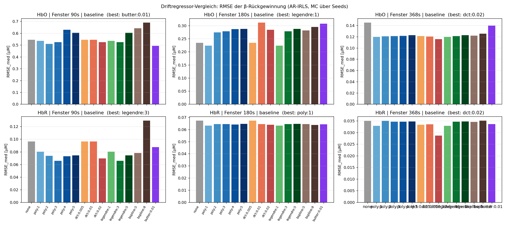
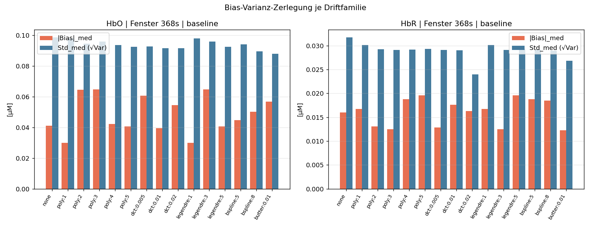
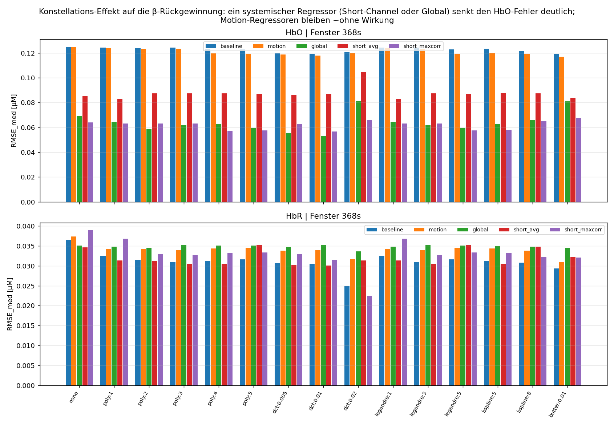
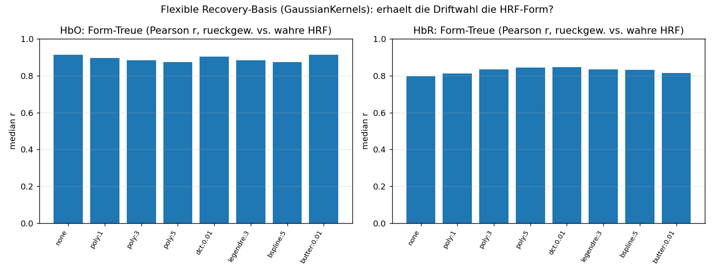
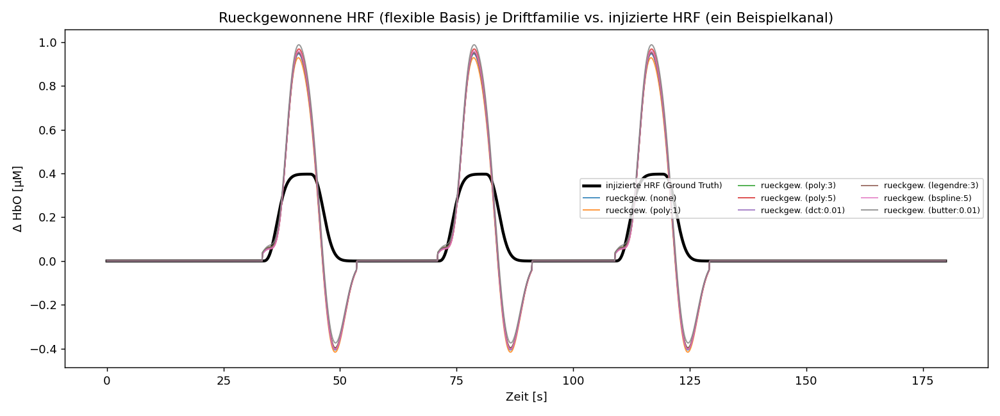
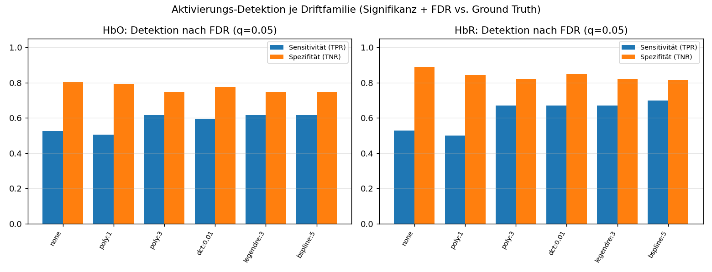

# Projektdokumentation

**Bachelorarbeit: „Vergleich verschiedener Driftregressoren im General Linear Model zur Schätzung der hämodynamischen Antwortfunktion in fNIRS-Daten"**
TU Berlin · Fachgebiet Neurotechnologie · Stand: 13. Juli 2026

---

## Für wen ist dieses Dokument?

Dieses Dokument erklärt **von Grund auf**, worum es in diesem Projekt geht, wie die
Software funktioniert und was bisher herausgekommen ist. Es ist bewusst so geschrieben,
dass man **keine Informatik- und keine Neurowissenschafts-Kenntnisse** braucht, um zu
verstehen, was hier passiert. Jeder Fachbegriff wird beim ersten Auftauchen erklärt; am
Ende gibt es ein Glossar zum Nachschlagen.

Inhalt:
1. [Das Projekt in einfachen Worten](#1-das-projekt-in-einfachen-worten)
2. [Die wichtigsten Begriffe – mit Alltagsvergleichen](#2-die-wichtigsten-begriffe--mit-alltagsvergleichen)
3. [Das Werkzeug „Cedalion" und seine Notebooks](#3-das-werkzeug-cedalion-und-seine-notebooks)
4. [Wie die Auswertung Schritt für Schritt funktioniert](#4-wie-die-auswertung-schritt-für-schritt-funktioniert)
5. [Der systematische Vergleich (der „Sweep")](#5-der-systematische-vergleich-der-sweep)
6. [Was bisher herausgekommen ist](#6-was-bisher-herausgekommen-ist)
7. [Die Dateien im Überblick](#7-die-dateien-im-überblick)
8. [Wie man alles ausführt](#8-wie-man-alles-ausführt)
9. [Was noch kommt (Ausblick)](#9-was-noch-kommt-ausblick)
10. [Glossar](#10-glossar)

---

## 1. Das Projekt in einfachen Worten

Wenn ein Bereich im Gehirn aktiv wird, verbraucht er mehr Sauerstoff, und der Körper
schickt kurz darauf **mehr Blut** dorthin. Diese Durchblutungsänderung kann man **von
außen durch den Schädel messen** – mit Licht. Genau das macht **fNIRS** (funktionelle
Nahinfrarotspektroskopie): schwaches Infrarotlicht wird auf den Kopf gestrahlt, ein Teil
davon kommt an anderer Stelle wieder heraus, und aus der Abschwächung lässt sich
berechnen, wie viel sauerstoffreiches und sauerstoffarmes Blut gerade unter der Haut
fließt.

Das Problem: Das gemessene Signal enthält **nicht nur** die Hirnaktivität, die uns
interessiert, sondern auch viel „Störung": Herzschlag, Atmung, langsames Wegdriften der
Messwerte, kleine Bewegungen. Besonders lästig ist das langsame **Driften** der Grundlinie
(englisch *drift*) – so, als würde ein Radiosender langsam wegwandern. Wenn man dieses
Driften nicht sauber herausrechnet, misst man die Hirnaktivität falsch.

Um das Driften herauszurechnen, baut man ins Auswertemodell (das **General Linear Model**,
siehe Kapitel 2) sogenannte **Driftregressoren** ein – mathematische „Formvorlagen" für das
langsame Driften. Davon gibt es verschiedene Sorten (Polynome, Cosinus-Funktionen,
Legendre-Polynome, B-Splines; dazu als Alternative einen Filter). **Die zentrale Frage der
Arbeit lautet:**

> **Welche Sorte von Driftregressor liefert unter welchen Bedingungen die genaueste
> Schätzung der Hirnaktivität?**

Für fMRT (die „große" Bildgebung im Kernspintomografen) ist das gut untersucht – für fNIRS
erstaunlicherweise kaum. Diese Lücke füllt die Arbeit.

**Vorgehen in zwei Stufen:**
1. **Simulation (aktueller Stand):** Wir nehmen echte Ruhemessungen (Person tut nichts) und
   „mischen" künstlich eine Hirnaktivität mit **exakt bekannter Stärke** hinein. Weil wir die
   Wahrheit kennen, können wir für jede Driftregressor-Sorte genau messen, wie nah die
   Schätzung an der Wahrheit liegt.
2. **Echte Daten (später):** Anwendung auf echte hochauflösende Messungen (300 Kanäle), bei
   denen Probanden *Tetris* spielen gegen Ruhe.

---

## 2. Die wichtigsten Begriffe – mit Alltagsvergleichen

**fNIRS** – Messung der Hirndurchblutung mit Infrarotlicht durch den Schädel. Nicht-invasiv,
tragbar, günstig.

**HbO und HbR** – die zwei Blut-Bestandteile, die fNIRS unterscheidet:
- **HbO** = oxygeniertes (sauerstoffreiches) Hämoglobin.
- **HbR** = deoxygeniertes (sauerstoffarmes) Hämoglobin.
Bei echter Hirnaktivität steigt **HbO** und sinkt **HbR** gleichzeitig (eine **inverse**
Beziehung). Findet man das im Signal, ist das ein gutes Plausibilitätszeichen.

**Kanal** – ein Messpunkt, gebildet aus einem Lichtsender und einem Lichtempfänger auf dem
Kopf. Viele Kanäle zusammen ergeben eine Karte der Hirnoberfläche. Unser Datensatz hat
**544 nutzbare Kanäle** – das ist „hochkanalig" und heißt auch **DOT** (Diffuse Optische
Tomografie).

**HRF (hämodynamische Antwortfunktion)** – die *typische Form* der Durchblutungsantwort auf
einen kurzen Reiz: Sie steigt über einige Sekunden an, erreicht nach ca. 5–6 s ein Maximum
und klingt dann wieder ab. Vergleich: Wirft man einen Stein ins Wasser, entsteht immer die
gleiche charakteristische Wellenform – die HRF ist diese „Standardwelle" der Durchblutung.

**Aktivierungsstärke β (beta)** – *wie hoch* die HRF-Welle an einem Kanal ausschlägt. Das
ist die eigentliche Zielgröße: β groß = starke Aktivierung. Die ganze Arbeit dreht sich
darum, dieses β möglichst genau zu **schätzen**.

**Drift** – langsames Wegwandern der Messwerte über die Zeit, unabhängig von jeder
Hirnaktivität (z. B. durch Erwärmung der Geräte, langsame Körpervorgänge). Der Störenfried,
den wir modellieren müssen.

**GLM (General Linear Model)** – das Auswertemodell. Idee: Das gemessene Signal wird als
**Summe mehrerer bekannter „Zutaten"** erklärt. Vergleich mit einem Rezept:

> gemessenes Signal ≈ β · (HRF-Zutat) + (Drift-Zutaten) + Rest.

Das GLM findet die Mischungsverhältnisse (u. a. das β), mit denen die Summe der Zutaten das
gemessene Signal am besten nachbildet. Die Tabelle aller Zutaten heißt **Designmatrix**.

**Driftregressor** – eine der „Drift-Zutaten" im Rezept. Es gibt mehrere Familien, die das
Driften unterschiedlich flexibel nachbilden:
- **Polynom (poly n):** einfache Kurven wachsender Krümmung (Gerade, Parabel, …). `n` = wie
  „gewellt" die Kurve sein darf.
- **DCT (diskrete Cosinus-Basis):** eine Sammlung von Cosinus-Wellen bis zu einer
  Grenzfrequenz – wirkt wie ein Hochpassfilter, lässt also nur „schnelle genug" Signale durch.
- **Legendre-Polynome:** mathematisch besonders „saubere" Polynome (gut trennbar).
- **B-Splines:** aus glatten Kurvenstücken zusammengesetzte, flexible Basis.
- **Butterworth-Hochpass:** *kein* Regressor im Rezept, sondern ein **Filter**, der das
  langsame Driften schon vor der Auswertung aus dem Signal entfernt – die *Alternative* zu
  Driftregressoren.
- **„none":** gar kein Drift-Modell (nur ein konstanter Grundwert) – als Vergleichs-Untergrenze.

**AR-IRLS** – das Schätzverfahren, mit dem das GLM gelöst wird. Es berücksichtigt, dass das
Rauschen in fNIRS nicht rein zufällig ist, sondern zeitlich „nachhallt" (autokorreliert).
**Wichtig:** AR-IRLS modelliert das *Rauschen*, nicht den *Drift* – der Drift kommt
ausschließlich über die Regressoren ins Modell.

**Ground Truth (Grundwahrheit)** – der bekannte, wahre Wert. In der Simulation kennen wir
β, weil wir es selbst hineingemischt haben. So können wir Schätzfehler exakt ausrechnen.

**Gütemaße** – womit wir „genau" messen (getrennt für HbO und HbR):
- **Bias (Verzerrung):** systematisches Daneben­liegen (im Schnitt zu hoch/zu niedrig).
- **Varianz / Streuung:** wie stark die Schätzung von Durchlauf zu Durchlauf schwankt.
- **RMSE (Wurzel des mittleren quadratischen Fehlers):** Gesamtfehler, fasst Bias und Streuung
  zusammen. Kleiner = besser.
Vergleich Dartscheibe: **Bias** = die Pfeile treffen konstant neben die Mitte; **Varianz** =
die Pfeile streuen weit; **RMSE** = wie schlecht insgesamt.

---

## 3. Das Werkzeug „Cedalion" und seine Notebooks

**Cedalion** ist ein frei verfügbares Python-Programmpaket zur fNIRS-/DOT-Auswertung,
mitentwickelt an der TU Berlin. Es liefert fertige, geprüfte Bausteine für alle Schritte
(Daten laden, Qualität prüfen, in Konzentrationen umrechnen, GLM rechnen, Aktivierung
simulieren, Karten zeichnen). Wir bauen darauf auf, statt alles selbst zu programmieren.

> **Grundsatz dieses Projekts:** Die offiziellen **Cedalion-Notebooks** (Schritt-für-Schritt-
> Beispiele) und die Dokumentation sind die **maßgebliche Referenz** – vor eigenem Wissen.
> Ein „Notebook" ist ein interaktives Dokument, das Erklärtext und lauffähigen Beispielcode
> mischt.

- **Online-Dokumentation:** https://doc.ibs.tu-berlin.de/cedalion/doc/dev/
- **Notebooks lokal:** im Schwester-Ordner `../cedalion/examples/`
- **Cedalion-Version in diesem Projekt:** 26.5.1 (Entwicklungszweig `dev`)

**Die für dieses Projekt wichtigsten Notebooks:**

| Notebook | Wofür |
|---|---|
| `examples/getting_started_io/13_data_structures_intro.ipynb` | Wie fNIRS-Daten in Cedalion aufgebaut sind |
| `examples/signal_quality/21_data_quality_and_pruning.ipynb` | Kanäle nach Signalqualität aussortieren |
| `examples/modeling/33_glm_illustrative_example.ipynb` | GLM verständlich erklärt |
| `examples/modeling/32_glm_fingertapping_example.ipynb` | GLM an echten Daten + **Kopf-Karten (scalp plot)** der β-Werte |
| `examples/modeling/31_glm_basis_functions.ipynb` | die HRF-„Formvorlagen" (Basisfunktionen) |
| `examples/modeling/35_statsmodels_overview.ipynb` | wie man die Ergebnisse (β, Statistik) ausliest |
| `examples/augmentation/62_synthetic_hrfs_example.ipynb` | **künstliche HRF einmischen** (Kernidee der Simulation) |
| `examples/tutorial/7_data_augmentation.ipynb` | Tutorial zur Datenaugmentation inkl. Kopf-Karten |

---

## 4. Wie die Auswertung Schritt für Schritt funktioniert

Das Herzstück ist die Datei `pipeline.py`. Sie baut aus Ruhedaten einen Testfall mit
**bekannter Wahrheit**. Hier die Schritte in Alltagssprache; in Klammern die
Cedalion-Bausteine und die Notebooks, an denen sie sich orientieren.

### Schritt 1 – Ruhedaten laden
Wir laden einen frei verfügbaren fNIRS-Ruhedatensatz („nn22"): eine Person, die ~6 Minuten
still sitzt. Er enthält **567 Kanäle**, misst mit ~**9 Messungen pro Sekunde**, bei zwei
Lichtfarben (760 und 850 Nanometer).
*(Cedalion: `cedalion.data.get_nn22_resting_state()`. Aufbau der Daten: Notebook
`getting_started_io/13`.)*

### Schritt 2 – Aufräumen: Bewegung herausrechnen, schlechte Kanäle aussortieren
Nicht jeder Kanal misst sauber, und die Person bewegt sich. Beides wird hier behandelt – in
einer **bestimmten Reihenfolge**, die nicht beliebig ist:

1. **Lichtstärke → optische Dichte.** Dabei wird der Ausgangspegel jedes Kanals (die
   „Baseline", also seine mittlere Helligkeit) **mitgespeichert**. Ohne ihn käme man später
   nicht zurück, denn die optische Dichte beschreibt nur *Änderungen* gegenüber dem eigenen
   Mittel, nicht die Helligkeit selbst.
2. **Bewegungsartefakte herausrechnen.** Sie treten in zwei Formen auf: als **scharfer
   Ausschlag** (Spike) und als **ruckartige Verschiebung** der Grundlinie. Dafür gibt es zwei
   Verfahren – *Wavelet* gegen Spikes, *TDDR* gegen Verschiebungen. Sie arbeiten auf der
   optischen Dichte, nicht auf der Helligkeit.
3. **Zurück zur Lichtstärke.** Erst hier lässt sich beurteilen, ob ein Kanal **zu dunkel**
   (kaum Licht, nur Rauschen) oder **gesättigt** ist (Detektor am Anschlag, Signal oben
   abgeschnitten). Beides sind Helligkeits-Begriffe – in der optischen Dichte sind sie gar
   nicht definiert. Deshalb der Umweg.
4. **Kanäle bewerten und aussortieren**, nach drei Kriterien: Signal-Rausch-Verhältnis
   (Schwelle 3), Helligkeitsfenster (0,001 bis 0,84 Volt), Sender-Empfänger-Abstand.
5. **Weiterarbeiten auf der optischen Dichte** und erst dann in Konzentrationen umrechnen.

Von **567** Rohkanälen bleiben **520** übrig: 6 fallen weg, weil ihre Lichtstärke stellenweise
auf null geht (physikalisch unmöglich, unter dem Rauschboden), 41 durch die Qualitätskriterien.

Wie gut ist die Helligkeits-Untergrenze gewählt? Der Datensatz enthält eine **Dunkelmessung**
(das Gerät misst bei ausgeschaltetem Licht mit) – daraus ergibt sich ein Rauschboden von
0,0000095 Volt. Die Grenze 0,001 Volt liegt also beim **105-fachen** davon. Und sie liegt in
einer Lücke: zwischen dem 50- und dem 105-fachen des Rauschbodens fällt **kein einziger**
weiterer Kanal heraus. Die beiden Gruppen – brauchbare und tote Kanäle – sind also klar
getrennt, die genaue Lage der Grenze ist unkritisch.

> **Ein Befund, der für diese Arbeit zentral ist:** Die beiden Bewegungs-Verfahren verhalten
> sich völlig unterschiedlich gegenüber dem **langsamen Driften**, um das es in dieser Arbeit
> geht. *Wavelet* lässt es unangetastet (100 % bleiben übrig). *TDDR* dagegen entfernt
> **fast die Hälfte davon** (nur 55,6 % bleiben) – es wirkt unterhalb von 0,5 Hz wie ein
> breiter Dämpfer. Damit würde ein Teil des Driftens schon vor der Auswertung verschwinden,
> und die Driftregressoren hätten weniger zu tun, als sie eigentlich sollten. Weil das die
> Kernfrage der Arbeit berührt, wird die Wahl des Verfahrens **nicht** festgelegt, sondern
> als eigene Vergleichsachse mitgeführt (Kapitel 5).
>
> **Und es trifft nicht nur das Driften, sondern die Hirnantwort selbst.** Die eingemischte
> HRF liegt im Bereich um 0,03 Hz – genau dort, wo TDDR dämpft. Gemessen kommt von der
> eingemischten Höhe nur noch **70 %** an (HbO wie HbR); bei *Wavelet* sind es 100 %.
> Damit unterschätzt TDDR die gesuchte Größe systematisch um rund 30 %.
>
> Warum das trotzdem zunächst wie eine Verbesserung *aussieht*: Ohne Bewegungskorrektur wird
> HbO ohnehin um **50 % überschätzt** (Schätzung 0,596 statt 0,397 – die Driftregressoren
> ziehen systemische Störungen in die Hirnantwort hinein). Die 30 % Dämpfung von TDDR heben
> einen Teil dieser Überschätzung zufällig wieder auf, der Fehler sinkt auf +0,059. Das ist
> aber **kein besseres Schätzen, sondern das Verrechnen zweier Fehler**. Sichtbar wird das an
> **HbR**: dort gibt es keine Überschätzung, gegen die sich etwas verrechnen könnte – und
> prompt verschlechtert TDDR den Fehler von +0,018 auf +0,071. Dieselbe Dämpfung, aber ohne
> den Gegenfehler.
>
> *(Zahlen aus `compare_preprocessing.py`, 3 Wiederholungen, Fenster 180 s, 20 aktivste
> Kanäle → `results/preprocessing_comparison.csv`. Der Vergleich läuft auf einer gemeinsamen
> Kanalbasis; deshalb sind „alte" und „neue" Kette ohne Bewegungskorrektur identisch – die
> Umstellung ändert nicht die Schätzung auf einem Kanal, sondern welche Kanäle eingehen.)*
>
> **Wichtig für die Aussagekraft:** Damit das überhaupt messbar ist, wird die künstliche
> Hirnantwort seit dem Umbau **vor** der Bewegungskorrektur eingemischt (in die optische
> Dichte), nicht danach. Sonst könnte die Korrektur die Antwort gar nicht erreichen – sie
> dürfte nur das Rauschen putzen und sähe künstlich gut aus. Auf echten Daten steckt die
> Hirnantwort ebenfalls im Signal, wenn korrigiert wird.

*(Cedalion: `cedalion.nirs.cw.int2od(..., return_baseline=True)` / `od2int(...)`,
`cedalion.sigproc.motion.tddr(...)` / `wavelet(...)`, `cedalion.sigproc.quality.snr / mean_amp /
sd_dist / prune_ch`. Notebooks `signal_quality/21`, `signal_quality/22`, Tutorial `3`.
Umgesetzt in `preprocess.py`; die Reihenfolge entspricht der Betreuungsvorgabe und zugleich
der von Cedalion empfohlenen Kette.)*

### Schritt 3 – Licht in Blutkonzentrationen umrechnen
Aus der optischen Dichte werden die Konzentrationsänderungen von **HbO** und **HbR** je Kanal
(in Mikromol, µM) – über das **modifizierte Beer-Lambert-Gesetz**. Das ist eine feste
physikalische Umrechnung ohne freie Entscheidungen.
*(Cedalion: `cedalion.nirs.cw.od2conc(...)`.)*

### Schritt 4 – Eine künstliche Hirnaktivität mit bekannter Stärke einmischen
Das ist der Trick, mit dem wir eine **Grundwahrheit** erzeugen. Wir nehmen die
Standard-HRF-Welle (eine **Gamma-Form**), skalieren sie auf **Höhe 1** (normieren) und
mischen sie mit einer selbst gewählten Stärke β in die Ruhedaten. Weil die Welle auf Höhe 1
normiert ist, **ist die eingemischte Stärke danach exakt gleich dem β**, das die Auswertung
zurückliefern soll. So können wir „Geschätzt vs. Wahrheit" direkt vergleichen.

Wichtige Feinheit (**räumlicher Blob**, seit Version 2): Eine echte Hirnaktivierung sitzt
**lokal** an einer Stelle, nicht überall gleich. Deshalb mischen wir die Aktivität als
**räumlichen Fleck** ein: Kanäle nahe dem Zentrum bekommen die volle Stärke (0,6 µM für
HbO), weiter entfernte Kanäle immer weniger (glockenförmiger Abfall, „Gauß-Blob", Breite
σ = 30 mm). Konkret sind ~24 Kanäle stark und ~95 überhaupt merklich aktiviert. HbR bekommt
dieselbe Form, aber mit umgekehrtem Vorzeichen und 40 % der Höhe (die inverse HbO/HbR-Beziehung).

*(Cedalion-Bezug: Idee und Bausteine aus Notebook `augmentation/62` und Tutorial `7`. Dort
wird der Fleck zuerst auf der Hirnoberfläche erzeugt und dann über ein Kopfmodell auf die
Kanäle projiziert. Wir definieren ihn stattdessen **direkt im Kanal-Raum** über die
Kanalpositionen – das entspricht der Betreuungsvorgabe („künstliche Aktivierung nicht im
Bildraum einfügen, sondern im Kanalraum, um realistischer zu sein"): eingemischt wird genau
dort, wo Ruhedaten und Aktivierung zusammengeführt werden, ohne den Umweg über ein
Vorwärtsmodell und dessen eigene Näherungen. Funktion `_spatial_beta` in `pipeline.py`.
Ein Kopfmodell **läge durchaus vor** – `cedalion.data.get_precomputed_sensitivity(
"nn22_resting", "colin27")` liefert die fertige Sensitivitätsmatrix für genau diesen
Datensatz –, es wird für die Einmischung aber bewusst nicht verwendet. Für den Vergleich
**im Bildraum** (Kapitel 9) kommt es dann zum Einsatz.)*

### Schritt 5 – Die Designmatrix (das „Rezept") zusammenstellen
Jetzt legen wir die „Zutaten" fest, mit denen das GLM das Signal erklären soll:
- die **HRF-Zutat** (dieselbe normierte Welle, die wir eingemischt haben – so ist der
  Vergleich fair),
- die **Drift-Zutaten** (je nach untersuchter Familie: Polynome, DCT, Legendre, B-Splines …),
- optional weitere Zutaten (siehe „Konstellationen" in Kapitel 5).
*(Cedalion: `hrf_regressors(...)`, `drift_regressors(...)`, `drift_cosine_regressors(...)`,
`drift_legendre_regressors(...)`; HRF-Formen aus Notebook `modeling/31`, Zusammenbau aus
`modeling/33`.)*


*Abb. 1 – Die Designmatrix (das „Rezept"). Oben die HRF-Zutat: die auf Höhe 1 normierte
Standardwelle, an jedem Stimulus wiederholt. Unten die Polynom-Drift-Zutaten, mit denen das
langsame Wegwandern der Grundlinie nachgebildet wird.*

### Schritt 6 – Das GLM lösen (schätzen)
Das GLM bestimmt die Mischungsverhältnisse aller Zutaten – insbesondere das geschätzte **β̂**
(sprich „beta-Dach") je Kanal. Wir nutzen das robuste Verfahren **AR-IRLS**.
*(Cedalion: `cedalion.models.glm.fit(..., noise_model="ar_irls")`, Ergebnis-Auslesen mit
`.sm.params`; Notebooks `modeling/32` und `35`.)*

### Schritt 7 – Vergleichen: Wie gut wurde die Wahrheit getroffen?
Für jeden aktiven Kanal vergleichen wir das geschätzte β̂ mit dem eingemischten wahren β und
berechnen **Bias, Varianz und RMSE** – getrennt für HbO und HbR. Zusätzlich prüfen wir die
**HbO/HbR-Plausibilität** (ist HbR etwa −0,4-mal HbO, wie eingemischt?).


*Abb. 2 – Ein einzelner Kanal über die Zeit. Grau: gemessenes Ruhesignal mit eingemischter
Aktivität. Rot: die eingemischte Wahrheit (Ground Truth). Blau: die vom GLM zurückgewonnene
HRF. Gepunktet: der Gesamt-Fit inklusive Drift. Grüne Streifen markieren die Stimulus-Zeiten.
Dass die blaue Kurve der roten Wahrheit folgt, zeigt: die Aktivität wird zurückgewonnen.*


*Abb. 3 – Geschätzte gegen wahre Aktivierungsstärke, ein Punkt je Kanal. Die gestrichelte
Linie ist die Ideallinie (Schätzung = Wahrheit). Punkte darüber = Überschätzung. Bei HbO
liegen die aktiven Kanäle überwiegend oberhalb → systematische Überschätzung. Die vielen
Punkte bei „wahres β ≈ 0" sind inaktive Kanäle (reines Rauschen).*

### Schritt 8 – Bilder zeichnen
Zur Kontrolle erzeugt `demo_figures.py` Diagramme, u. a. **Kopf-Karten (scalp plots)**, auf
denen jeder Kanal an seiner Position auf dem Kopf farbig dargestellt wird (z. B. „wie weit
lag die Schätzung daneben?").
*(Cedalion: `cedalion.vis.anatomy.scalp_plot(...)`; Vorbild Notebook `tutorial/7` und
`modeling/32`.)*


*Abb. 4 – Kopf-Karte des Schätzfehlers (β̂ − Wahrheit) je Kanal, getrennt für HbO und HbR.
Jeder Kanal ist an seiner Position auf dem Kopf eingezeichnet; die Farbe zeigt die Abweichung
(blau = zu niedrig, rot = zu hoch, weiß = korrekt). Rote/blaue Quadrate sind die Sender/
Empfänger auf dem Kopf.*


*Abb. 5 – Relative Abweichung, nur in der aktiven Region gezeigt (graue Kanäle liegen
außerhalb der Aktivierung). Oben: relativer Fehler der Amplitude; unten: ein Formfehler-Maß.*

---

## 5. Der systematische Vergleich (der „Sweep")

Ein einzelner Durchlauf beantwortet die Forschungsfrage noch nicht. Dafür wiederholen wir
die Schritte 4–7 **systematisch für alle Kombinationen** von Einflussgrößen. Das erledigt
`sweep.py`. „Sweep" heißt sinngemäß „alles einmal durchfahren".

Variiert werden vier Achsen:
1. **Driftregressor-Familie** (die Hauptfrage): 15 Varianten – Polynom Ordnung 1–5, DCT mit
   3 Grenzfrequenzen, Legendre Ordnung 1/3/5, **B-Splines** (5 und 8 Knoten), „kein Drift",
   Butterworth-Hochpass.
2. **Fensterlänge:** Wie lang ist der ausgewertete Zeitausschnitt? (90 s, 180 s und 368 s =
   die ganze Aufnahme.) Kürzere Fenster sind schwieriger.
3. **Konstellation:** Welche *weiteren* Zutaten sind im Rezept? – `baseline` (nur HRF+Drift),
   `+motion` (Bewegungssignale aus dem eingebauten Beschleunigungssensor), `+global`
   (ein „Gesamtsignal"-Regressor als Ersatz für systemische Störungen) und beides kombiniert.
   *(Hinweis: Echte „Short-Channel"-Regression – ein Standardtrick mit sehr kurzen
   Messkanälen – ist mit diesem Datensatz nicht möglich, weil er keine solchen kurzen Kanäle
   enthält. Der Global-Regressor ist der passende Ersatz.)*
4. **Zufalls-Wiederholungen (Seeds):** Die künstlichen Reize werden zu leicht anderen
   Zeitpunkten platziert (mehrere Wiederholungen). Erst der Vergleich **über diese
   Wiederholungen** liefert eine echte Bias-/Varianz-Aussage (nicht der Vergleich über Kanäle).

Das ergibt in der Vollversion (v3) 15 × 3 × 4 × 4 = **720 Auswertungen**. Jede dauert mit
AR-IRLS ~12–37 Sekunden (je nach Fensterlänge) auf einem ausgewählten Satz der am stärksten
aktivierten Kanäle; der ganze Durchlauf ~3 Stunden. Ergebnisse landen in `results/`
(Tabelle `sweep_summary.csv`, Rohdaten `sweep_per_channel.nc`), Abbildungen und
Markdown-Tabellen erzeugt `sweep_report.py`.

> **Wichtiger methodischer Hinweis (aus dem Betreuungsgespräch):** Bei Auswertungen *mit*
> Driftregressoren wird das Signal **nicht** hochpassgefiltert – ein Hochpassfilter würde
> genau den Drift entfernen, den die Regressoren modellieren sollen, und den Vergleich
> verfälschen. Der Butterworth-Hochpass ist deshalb die **eigenständige Alternative**
> (Filter *statt* Regressoren), nicht zusätzlich.

### Zusatz-Analyse 1: Formfehler mit flexibler Formvorlage

Bisher nutzen Einmischung und Auswertung dieselbe HRF-Formvorlage (die Gamma-Welle). Dadurch
kann sich zwischen „eingemischt" und „geschätzt" nur die **Höhe** unterscheiden, nicht die
**Form**. Um zu prüfen, ob eine schlechte Drift-Modellierung auch die *Form* der geschätzten
Antwort verzerrt, wird zusätzlich mit einer **flexiblen** Formvorlage ausgewertet
(`GaussianKernels` – eine Reihe von Glockenkurven, die zusammen praktisch jede Kurvenform
annehmen können). Als Maß dient die **Form-Treue**: die Korrelation zwischen zurückgewonnener
und eingemischter HRF-Kurve. Diese ist *skaleninvariant* – sie misst also reine Form,
unabhängig von der Höhe (1,0 = perfekte Form). Skript: `flex_basis.py`.
*(Cedalion: `glm.GaussianKernels`; HRF-Formvorlagen aus Notebook `modeling/31`.)*

### Zusatz-Analyse 2: Statistische Absicherung – Signifikanz und Mehrfachvergleichs-Korrektur

Für die spätere Auswertung echter Daten – und als methodische Vollständigkeit – wird die
statistische Absicherung demonstriert: Für jeden Kanal wird geprüft, ob die geschätzte
Aktivierung **statistisch signifikant** von null verschieden ist (Signifikanz = Schätzung
geteilt durch ihren Standardfehler, daraus ein p-Wert). Weil **sehr viele Kanäle gleichzeitig**
getestet werden, muss für **multiples Testen korrigiert** werden (Verfahren Benjamini-Hochberg,
„FDR", Niveau 5 %) – sonst entstünden allein durch Zufall zahlreiche Falsch-Positive.

Da wir in der Simulation die Wahrheit kennen (welche Kanäle wirklich aktiv sind = der Blob),
lässt sich die **Detektionsgüte** direkt messen:
- **Sensitivität** – Anteil der wirklich aktiven Kanäle, die auch erkannt werden;
- **Spezifität** – Anteil der Ruhe-Kanäle, die korrekt als inaktiv gelten;
- **Youden-J** (= Sensitivität + Spezifität − 1) als Gesamtmaß.

So zeigt sich, welche Driftfamilie die zuverlässigste Aktivierungs-Erkennung liefert. Dieses
Skript (`detection.py`) fittet über **alle** 544 Kanäle (nur so sind Falsch-Positive
bewertbar) und demonstriert damit die komplette Inferenz-Pipeline für die realen DOT-Daten.
*(Cedalion: `.sm.params` + `.sm.regressor_variances()`; FDR über `statsmodels`.)*

---

## 6. Was bisher herausgekommen ist

Die Studie lief in drei Ausbaustufen. **v1** mischte die Aktivität überall gleich stark ein
(räumlich „flach") – das führte zu einem Trugschluss beim Global-Regressor und wurde in **v2**
durch den räumlichen Blob behoben. **v3** ist die vollständige
Simulationsstudie: 15 Driftfamilien (inkl. B-Splines) × 3 Fenster (90/180/368 s) ×
4 Konstellationen × 4 Wiederholungen (720 Auswertungen) plus die beiden Zusatz-Analysen. Die
folgenden Zahlen stammen aus **v3**. Alle Tabellen dazu: `results/tables.md`.

**Ergebnis 1 – Systemische Störungen sind der größte Hebel (für HbO).**
Ein **Global-Regressor** halbiert den HbO-Gesamtfehler (RMSE im Mittel **0,32 → 0,18 µM**) und
verringert eine systematische **Überschätzung**. Grund: Benachbarte aktive Kanäle teilen sich
systemische Körpersignale (z. B. Blutdruckwellen); ein reines Drift-Modell zieht diese teils
fälschlich in die Hirnaktivität. → **Der systemische Regressor wirkt sich stärker aus als die
Wahl der Driftfamilie.** (Bewegungsregressoren aus dem Beschleunigungssensor: praktisch ohne
Wirkung – erwartet, da die *synthetische* HRF nicht mit echter Bewegung koppelt.)

**Ergebnis 2 – HbR ist unempfindlicher als HbO.** Der HbR-Fehler (~0,06 µM) ändert sich über
alle Konstellationen kaum – HbR ist weniger von systemischen Störungen betroffen (physiologisch
plausibel, eigenständiges Ergebnis).

**Ergebnis 3 – Die Fensterlänge dominiert.** HbO-RMSE (baseline): **90 s ≈ 0,56 → 180 s ≈ 0,27
→ 368 s ≈ 0,12 µM** – die ganze Aufnahme ist ~4,5-mal genauer als ein 90-s-Fenster. Mehr Daten
(und mehr Reize im Fenster) → stabilere Schätzung.

**Ergebnis 4 – Familienwahl: kontextabhängig, insgesamt moderat.**
- **Lange Fenster (368 s):** Alle Driftregressor-Familien rücken eng zusammen (HbO-RMSE
  0,116–0,126) und schlagen deutlich „kein Drift" (0,145) und Butterworth (0,140). → *Dass*
  ein Drift-Modell da ist, zählt; *welche* Familie, kaum. Bestwert: DCT ~0,02 Hz.
- **Kurze Fenster (90 s):** Hier gewinnt die Filter-Alternative (Butterworth) bzw. niedrige
  Ordnung; **sehr hohe Ordnungen überanpassen** (erklären echte Aktivität weg).
- **B-Splines** liegen gleichauf mit Polynom/Legendre/DCT – kein Vor-, kein Nachteil.

**Ergebnis 5 – Plausibilität.** Das zurückgewonnene HbR/HbO-Verhältnis liegt bei ~−0,25
(eingemischt −0,4); die Abweichung Richtung 0 spiegelt die HbO-Überschätzung und bessert sich
mit dem Global-Regressor.

**Ergebnis 6 – Die Form der HRF wird treu zurückgewonnen (Zusatz-Analyse 1).** Mit der
flexiblen Formvorlage ist die **Form-Treue hoch (~0,87–0,91) und über die Driftfamilien
ähnlich** → die Drift-Wahl verzerrt die *Form* der geschätzten Antwort nur wenig (die *Höhe*
schon, s. Ergebnis 1/5). Nebenbefund: die flexible Basis **überschätzt die Amplitude**
(+30–70 %) – der bekannte Bias-Varianz-Preis flexibler HRF-Modelle.

**Ergebnis 7 – Aktivierungs-Detektion nach FDR (Zusatz-Analyse 2).** Über alle 544 Kanäle mit
FDR-Korrektur (q = 0,05): **moderate Drift-Modelle detektieren am besten** (Youden-J HbO/HbR:
DCT 0,01 ≈ Polynom 3 ≈ Legendre 3 ≈ B-Spline 5), „kein Drift" hat die höchste **Spezifität**
(wenige Falsch-Positive), aber die niedrigste **Sensitivität** (verpasst echte Aktivierungen).
Die Inferenz-Pipeline (Signifikanz + FDR) steht damit bereit für die realen Daten.

**Nutzungsempfehlung (Stand Simulation):** (1) In fokalen Aktivierungsregionen einen
**systemischen/Global-Regressor** verwenden – der größte Genauigkeits-Hebel für HbO.
(2) Möglichst **lange Auswertefenster**. (3) Beim Drift ist **irgendein** moderates Modell
wichtig (DCT ~0,01–0,02 Hz oder Polynom/Legendre niedriger–mittlerer Ordnung robust); sehr
hohe Ordnungen bei kurzen Fenstern meiden. (4) Für die Aktivierungs-*Detektion* lohnt ein
moderates Drift-Modell (bessere Sensitivität) gegenüber „gar kein Drift".

### Abbildungen zum Hauptsweep


*Abb. 6 – Gesamtfehler (RMSE) je Driftregressor-Familie, für HbO (oben) und HbR (unten), je
Fensterlänge (90 / 180 / 368 s). Niedriger = besser. Sichtbar: längere Fenster sind durchweg
genauer; bei 368 s liegen die Familien eng beieinander.*


*Abb. 7 – Aufteilung des Fehlers je Familie in Bias (systematische Verzerrung) und Streuung.*


*Abb. 8 – Wirkung der Konstellation. Der Global-Regressor (grün/rot) senkt den HbO-Fehler
(oben) deutlich gegenüber baseline/motion (blau/orange). Bei HbR (unten) ist der Effekt klein.*


*Abb. 9 – Plausibilität: zurückgewonnenes HbR/HbO-Verhältnis je Familie; gestrichelt der wahre,
eingemischte Wert (−0,4).*

### Abbildungen zu den Zusatz-Analysen


*Abb. 10 – Form-Treue (Korrelation rückgewonnene vs. injizierte HRF) je Driftfamilie, flexible
Formvorlage. Hoch und über Familien ähnlich → die Drift-Wahl verzerrt die HRF-Form kaum.*


*Abb. 11 – Beispiel: rückgewonnene HRF-Kurven (flexible Basis) je Driftfamilie gegen die
injizierte Ground-Truth-HRF (schwarz), ein Kanal.*


*Abb. 12 – Aktivierungs-Detektion nach FDR-Korrektur (q = 0,05) je Driftfamilie:
Sensitivität (blau) und Spezifität (orange), HbO/HbR. Moderate Drift-Modelle geben die beste
Balance; „kein Drift" ist spezifisch, aber unsensitiv.*

---

## 7. Die Dateien im Überblick

Alle Dateien liegen in diesem Repository-Ordner `fnirs-drift-glm/` (als eigenständiges
Git-Repo neben `../cedalion/` nutzbar).

| Datei | Aufgabe |
|---|---|
| `pipeline.py` | **Kernstück.** Lädt Ruhedaten, mischt die künstliche HRF als räumlichen Blob ein, baut die Designmatrix. Liefert alles Weitere. |
| `sweep.py` | Der **systematische Vergleich** über alle Kombinationen (Kapitel 5). Schreibt Ergebnisse + eine Live-Fortschrittsdatei. |
| `sweep_report.py` | Erzeugt aus den Sweep-Ergebnissen die **Abbildungen** und **Markdown-Ergebnistabellen** (`results/tables.md`). |
| `flex_basis.py` | **Zusatz-Analyse 1:** flexible HRF-Formvorlage → Form-Treue (Formfehler unabhängig von der Höhe). |
| `detection.py` | **Zusatz-Analyse 2:** Signifikanz je Kanal + FDR-Korrektur → Detektionsgüte gegen die Ground Truth. |
| `demo_recovery.py` | **End-to-end-Demo (Zahlen):** ein Durchlauf, gibt Fehlerkennzahlen aus. |
| `demo_figures.py` | **End-to-end-Demo (Bilder):** Designmatrix, Ein-Kanal-Fit, β̂-vs-Wahrheit, Kopf-Karten. |
| `tests/` | Schnelle **Smoke-Tests** (pytest) für die Pipeline. |
| `results/` | Ausgaben: `sweep_summary.csv`, `sweep_per_channel.nc`, `tables.md`, `flex_basis_summary.csv`, `detection_summary.csv`, `*_progress.txt`. |
| `figures/` | Alle erzeugten Abbildungen (PNG). |
| `environment.lock.txt` | Exakte Versionen der Kern-Pakete (Reproduzierbarkeit). |
| `README.md` | Knappe technische Ausführ-/Reproduktions-Anleitung. |
| `../cedalion/` | Cedalion-Framework (Schwester-Ordner) inkl. Beispiel-Notebooks unter `../cedalion/examples/`. |

---

## 8. Wie man alles ausführt

Vorbereitet ist eine Python-Umgebung namens `cedalion`. Alle Befehle aus diesem Repo-Ordner:

```bash
# Umgebung aktivieren (einmal pro Terminal) und in den Repo-Ordner wechseln
source ~/anaconda3/etc/profile.d/conda.sh
cd fnirs-drift-glm

# 1) End-to-end-Demo mit Zahlen (~einige Minuten)
conda run -n cedalion python demo_recovery.py

# 2) Kontroll-Abbildungen erzeugen
conda run -n cedalion python demo_figures.py

# 3) Schnelltests (Sekunden–Minuten)
conda run -n cedalion python -m pytest tests -q          # Smoke-Tests
conda run -n cedalion python sweep.py pilot              # alle Code-Pfade, ~5 min
conda run -n cedalion python flex_basis.py test          # ~1 min
conda run -n cedalion python detection.py test           # ~1 min

# 4) Hauptstudie v3 (720 Auswertungen, ~3 Stunden)
conda run -n cedalion python sweep.py v3
#    Fortschritt live verfolgen (in einem zweiten Terminal):
cat results/sweep_progress.txt

# 5) Zusatz-Analysen (schreiben ebenfalls *_progress.txt)
conda run -n cedalion python flex_basis.py               # ~20 min
conda run -n cedalion python detection.py                # ~60–75 min (Fits über ALLE Kanäle)

# 6) Auswertungs-Abbildungen + Ergebnistabellen erzeugen
conda run -n cedalion python sweep_report.py
```

*(Technischer Hinweis für WSL/Windows: Dateien immer aus der Linux-Umgebung heraus
bearbeiten, nicht mit nativen Windows-Werkzeugen – sonst werden durch Zeilenende-Umschreibung
scheinbar alle Cedalion-Dateien „verändert".)*

---

## 9. Was noch kommt (Ausblick)

Der **rechnerische/analytische** Teil der Simulationsstudie ist abgeschlossen (Version 3).

**Inzwischen umgesetzt (v3):**
- **Längere Fenster (bis 368 s)** und Monte-Carlo über mehrere Wiederholungen.
- **B-Splines** als zusätzliche Driftfamilie.
- **Flexible HRF-Formvorlage** (`GaussianKernels`) → der Formfehler ist jetzt unabhängig von
  der Höhe messbar (Zusatz-Analyse 1, Kapitel 5).
- **Statistische Absicherung** (Signifikanz je Kanal + FDR-Korrektur) mit Detektionsgüte
  gegen die Ground Truth (Zusatz-Analyse 2, Kapitel 5).
- **Reproduzierbarkeit:** Smoke-Tests, Versions-Sperrdatei, README.

**Noch offen – echte Daten (Stufe 2 der Arbeit):**
- Anwendung auf die **300-Kanal-DOT-Tetris-Daten** (Tetris vs. Ruhe), sobald verfügbar.
  Bis dahin dient ein öffentlicher Finger-Tapping-DOT-Datensatz als hochkanaliger Platzhalter.
- Dort ist auch **echte Short-Channel-Regression** möglich (die Montage enthält kurze Kanäle).
- Die in Zusatz-Analyse 2 aufgebaute Inferenz-Pipeline (Signifikanz + FDR) wird dann auf die
  reale Frage angewandt: Wo unterscheiden sich Tetris und Ruhe signifikant?

**Abschließend – Verschriftlichung (durch den Autor):**
- Methoden-, Ergebnis- und Diskussionsteil der Bachelorarbeit; Einordnung in die Fachliteratur
  und Ableitung der finalen **Nutzungsempfehlung**, welcher Driftregressor unter welchen
  Bedingungen die zuverlässigste Schätzung liefert. (Diese Dokumentation und die
  Ergebnistabellen in `results/tables.md` liefern dafür das Material.)

---

## 10. Glossar

- **AR-IRLS** – robustes GLM-Schätzverfahren, das zeitlich „nachhallendes" Rauschen
  berücksichtigt (modelliert das Rauschen, nicht den Drift).
- **β / β̂** – wahre bzw. geschätzte Aktivierungsstärke an einem Kanal.
- **Bias** – systematische Verzerrung der Schätzung (im Mittel zu hoch/zu niedrig).
- **B-Splines** – stückweise glatte Kurvenstücke; hier eine Driftfamilie (eigene Regressorspalten).
- **Butterworth-Hochpass** – Filter, der langsames Driften vor der Auswertung entfernt;
  Alternative zu Driftregressoren.
- **Cedalion** – das verwendete Python-Framework für fNIRS/DOT.
- **DCT** – diskrete Cosinus-Basis; Driftfamilie aus Cosinus-Wellen bis zu einer Grenzfrequenz.
- **Designmatrix** – Tabelle aller „Zutaten" (Regressoren) im GLM.
- **DOT** – Diffuse Optische Tomografie; hochkanaliges fNIRS mit räumlicher Auflösung.
- **Drift** – langsames, nicht-hirnbezogenes Wegwandern der Messwerte.
- **FDR (False Discovery Rate)** – Korrektur für multiples Testen (Benjamini-Hochberg):
  begrenzt den erwarteten Anteil an Falsch-Positiven, wenn viele Kanäle gleichzeitig getestet werden.
- **Flexible Formvorlage** – HRF-Basis, deren Kurvenform frei ist (`GaussianKernels`);
  ermöglicht die Messung des Formfehlers unabhängig von der Höhe.
- **fNIRS** – funktionelle Nahinfrarotspektroskopie; Hirndurchblutungsmessung mit Licht.
- **GLM** – General Linear Model; erklärt das Signal als gewichtete Summe bekannter Zutaten.
- **Ground Truth** – der bekannte wahre Wert (in der Simulation von uns eingemischt).
- **HbO / HbR** – sauerstoffreiches / sauerstoffarmes Hämoglobin; steigen bzw. fallen bei
  Aktivierung.
- **HRF** – hämodynamische Antwortfunktion; typische Form der Durchblutungsantwort auf einen Reiz.
- **Kanal** – Messpunkt aus Sender+Empfänger; viele Kanäle = Karte der Hirnoberfläche.
- **Konstellation** – welche zusätzlichen Regressoren (Bewegung, Global) im Modell sind.
- **Legendre-Polynome** – mathematisch besonders „saubere" Polynome; eine Driftfamilie.
- **RMSE** – Gesamtfehlermaß (kleiner = besser); fasst Bias und Varianz zusammen.
- **Scalp plot** – Kopf-Karte: jeder Kanal farbig an seiner Kopfposition dargestellt.
- **Seed** – Startwert des Zufallsgenerators; unterschiedliche Seeds = unterschiedliche
  (reproduzierbare) Zufalls-Wiederholungen.
- **Sensitivität (TPR)** – Anteil der wirklich aktiven Kanäle, die (nach FDR) erkannt werden.
- **SNR** – Signal-Rausch-Verhältnis; Maß für Kanalqualität.
- **Spezifität (TNR)** – Anteil der inaktiven Kanäle, die korrekt als inaktiv gelten.
- **Sweep** – systematisches Durchrechnen aller Einstellungs-Kombinationen.
- **Varianz** – wie stark die Schätzung zwischen Wiederholungen schwankt.
- **Youden-J** – Gesamtmaß der Detektion: Sensitivität + Spezifität − 1 (1 = perfekt).

---

*Diese Dokumentation beschreibt den Stand vom 13. Juli 2026. Die inhaltliche Roadmap steht
in Kapitel 9 (Ausblick).*
